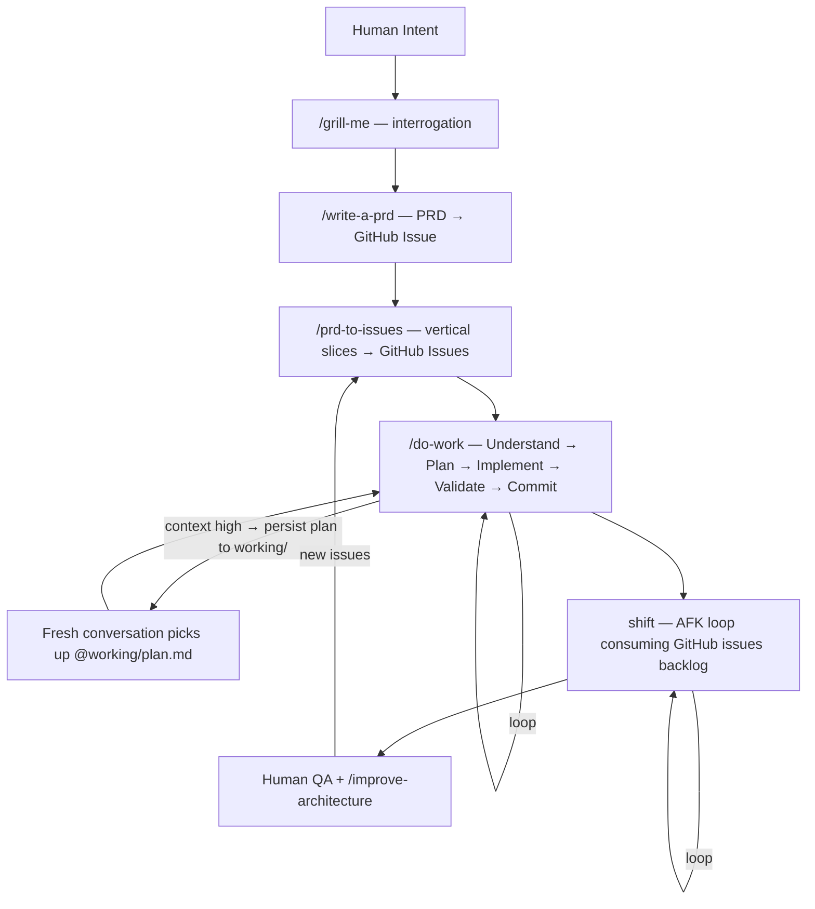

<p align="center">
  
</p>

# ctrl

[](LICENSE)

> Dotfiles for AI coding agents. One repo syncs instructions, skills, secrets, and autonomous loops across every machine.

Every developer using Claude Code or Copilot hits the same walls. Context degrades mid-task — the agent repeats itself, compaction loses nuance, quality drops. Instructions drift between your laptop and VPS. Secrets leak into agent context. Irrelevant rules load for every project regardless of stack.

ctrl fixes all four. Clone it once, `bootstrap.sh` symlinks your instructions, skills, agents, and rules into `~/.claude/`, and `git pull` updates every machine. `detect-context.sh` loads only the rules that match your current stack. Secrets split into two tiers — config the agent can see, credentials that exist only inside a child process and vanish when it exits (`run-with-secrets.sh`). When context gets high, the agent persists its plan to `working/` so a fresh conversation continues exactly where the old one left off.

```bash
git clone https://github.com/arndvs/ctrl.git ~/dotfiles
bash ~/dotfiles/bin/bootstrap.sh
```

Bootstrap is idempotent and cross-platform. It symlinks `~/.claude/CLAUDE.md`, `~/.claude/skills/`, `~/.claude/agents/`, and `~/.claude/rules/`, wires shell integration into `~/.bashrc`/`~/.zshrc`, creates `secrets/` from templates, and adds supply chain protection to `~/.npmrc` and `uv.toml`. Full details in the [Installation](#installation) section.

---

## The pipeline

```
/grill-me       → Interrogate you about a feature until shared understanding
/write-a-prd    → Explore codebase, interview, write PRD, submit as GitHub issue
/prd-to-issues  → Break the PRD into vertical slices → GitHub issues (AFK vs HITL labeled)
/do-work        → Understand → Plan → Implement → Validate → Commit (loops)
shift           → Pick issues from the backlog, implement in a Docker sandbox, commit, repeat
```

Use any skill individually or chain them. The planning pipeline hands off between stages automatically.



Use any skill individually or chain them. The planning pipeline (grill-me → write-a-prd → prd-to-issues → do-work) hands off between stages.

---

## How it works

### One repo, every machine

Clone to `~/dotfiles` on your laptop, your VPS, anywhere. `git pull` updates both. That's it.

You edit `CLAUDE.base.md` (tracked in git). `bootstrap.sh` generates `CLAUDE.md` from it by appending `@`-references to any local instruction files in `instructions/_local/`. The generated file is symlinked to `~/.claude/` and read by Claude Code at runtime.

### Progressive context loading

`detect-context.sh` scans your working directory and exports `ACTIVE_CONTEXTS`. A Next.js project loads Next.js rules. A PHP project loads PHP rules. Nothing leaks between stacks.

```
VS Code opens a project
  ↓
CLAUDE.md → global.instructions.md (always loaded)
  ↓
detect-context.sh → ACTIVE_CONTEXTS=general,nextjs,node,typescript,sanity,prisma
  ↓
loads matching instructions/*.md
  ↓
rules/ scoped by paths: frontmatter — load only when matching files are touched
  ↓
agents/ available as subagent personas — isolated context, read-only tools
  ↓
skills/ auto-discovered — workflow + your personal _local/ skills
```

One setting enables the chain: `"chat.instructionsFilesLocations": {"~/dotfiles": true}` — included in `settings.json`, applied by `sync-settings.sh`.

### Private skills and instructions

`skills/_local/` and `instructions/_local/` are gitignored. Drop private or business-specific files there — auto-discovered alongside the public ones, never leave your machine.

```
skills/
├── do-work/                 ← public, tracked
├── systematic-debugging/    ← public, tracked
└── _local/                  ← GITIGNORED — yours alone
    └── your-skill/SKILL.md
```

### Subagent personas

`agents/` defines specialized subagents with their own system prompts, tool restrictions, and model preferences. Each runs in an isolated context window — exploration stays out of your main conversation.

| Agent              | Focus                                           |
| ------------------ | ----------------------------------------------- |
| `code-reviewer`    | Bugs, security, logic errors — not style nits   |
| `researcher`       | Deep codebase exploration, architecture mapping  |
| `security-auditor` | OWASP Top 10, secrets exposure, config hardening |

All three use `model: sonnet`, read-only tools (Read, Grep, Glob, Bash), and `memory: user` for persistent cross-project learnings. Add your own: `agents/your-agent.md` — auto-discovered.

### Path-scoped rules

`rules/` contains convention-enforcement files that load only when the agent touches matching files. Each rule uses `paths:` YAML frontmatter to scope itself.

| Rule                 | Scoped to                                           |
| -------------------- | --------------------------------------------------- |
| `test-conventions`   | `**/*.test.*`, `**/*.spec.*`, `**/__tests__/**`     |
| `migration-safety`   | `**/migrations/**`, `**/prisma/migrations/**`       |
| `env-security`       | `**/.env*`, `**/secrets/**`, `**/credentials*`      |

Rules without `paths:` load every session. Add your own: `rules/your-rule.md` — auto-discovered.

### Hardened secrets

Two tiers. Agents see config, never credentials.
Two tiers. Agents see config, never credentials.

| File                   | In shell? | Agent-visible? | Contains                    |
| ---------------------- | --------- | -------------- | --------------------------- |
| `secrets/.env.agent`   | Yes       | Yes            | Usernames, hosts, IDs       |
| `secrets/.env.secrets` | No        | No             | API keys, tokens, passwords |

`run-with-secrets.sh` injects credentials into a child process only — they vanish when it exits. Claude Code deny rules block `env`, `printenv`, `cat secrets/*`, and `echo $*KEY*` at the agent level. Agents can't accidentally inherit what they can't see.

---

## Skills

Skills marked ⚡ auto-invoke when the agent detects a matching task. Others require explicit `/slash-command` invocation.

| Skill                    | What it does                                                                                                                     |
| ------------------------ | -------------------------------------------------------------------------------------------------------------------------------- |
| `do-work`                | Detect your stack's feedback loops. Understand → Plan → Implement → Validate → Commit.                                           |
| `grill-me`               | Interrogate you about a plan until shared understanding. One question at a time, recommended answers.                            |
| `write-a-prd`            | Explore codebase, interview you, sketch module boundaries, write PRD, submit as GitHub issue.                                    |
| `prd-to-issues`          | Break a PRD into vertical slices. Label each AFK or HITL. Create GitHub issues with dependencies.                                |
| `technical-fellow` ⚡    | Plan implementation — vertical slices, dependency graphs, acceptance criteria.                                                    |
| `skill-scaffolder`       | Scaffold new agent skills from production-tested patterns. Interview → architecture → directory.                                  |
| `explore` ⚡             | Decompose a topic, spawn parallel sub-agents, synthesize a summary.                                                              |
| `research` ⚡            | Cache expensive exploration into `research.md`. Staleness checks, lifecycle management.                                          |
| `codebase-audit` ⚡      | Ruthless code audit — real problems only, grouped by severity. No manufactured issues.                                           |
| `improve-architecture` ⚡ | Find shallow-module clusters, spawn parallel design agents, file a GitHub RFC.                                                  |
| `tdd`                    | Red-green refactor. Failing test → implement → refactor. Backend only.                                                           |
| `systematic-debugging` ⚡ | Root-cause-first — investigate → pattern analysis → hypothesis → fix.                                                           |

Add your own: `skills/_local/your-skill/SKILL.md` — auto-discovered, gitignored.

---

## Coding principles

Four behavioral principles baked into `global.instructions.md`, derived from [Andrej Karpathy's observations](https://x.com/karpathy/status/2015883857489522876) on LLM coding pitfalls. These address the most expensive failure modes: building the wrong thing, overengineering, drive-by refactoring, and vague success criteria.

### 1. Think Before Coding

> Don't assume. Don't hide confusion. Surface tradeoffs.

LLMs silently pick an interpretation and run with it. These rules force explicit reasoning:

- **Stop when confused** — Name what's unclear and ask. Never pick an interpretation silently
- **Present multiple interpretations** — If ambiguity exists, list options and ask which one before implementing
- **Push back when simpler exists** — If a simpler approach works, say so — even if the user asked for the complex version
- **State assumptions explicitly** — If uncertain, ask follow-up questions. Think "What's wrong with this plan?"

### 2. Simplicity First

> Minimum code that solves the problem. Nothing speculative.

Combat the tendency toward overengineering:

- No features beyond what was asked
- No abstractions for single-use code
- No "flexibility" or "configurability" that wasn't requested
- No error handling for impossible scenarios
- If 200 lines could be 50, rewrite it

**The test:** Would a senior engineer say this is overcomplicated? If yes, simplify.

### 3. Surgical Changes

> Touch only what you must. Clean up only your own mess.

When editing existing code:

- **Match existing style exactly** — even if you'd write it differently. No formatting, naming, or structural changes outside the task
- **Don't refactor what isn't broken** — if you notice unrelated problems, mention them — don't fix them
- **Mention unrelated dead code, don't delete it** — only remove imports/variables/functions that YOUR changes made unused
- **Don't "improve" adjacent code**, comments, or formatting

**The test:** Every changed line should trace directly to the user's request.

### 4. Goal-Driven Execution

> Define success criteria. Loop until verified.

Transform imperative tasks into verifiable goals:

| Instead of...    | Transform to...                                       |
| ---------------- | ----------------------------------------------------- |
| "Add validation" | "Write tests for invalid inputs, then make them pass" |
| "Fix the bug"    | "Write a test that reproduces it, then make it pass"  |
| "Refactor X"     | "Ensure tests pass before and after"                  |

For multi-step tasks, state a brief plan with verification at each step. Strong success criteria let the agent loop independently. Weak criteria ("make it work") require constant clarification.

ctrl extends this with dedicated skills: `tdd` (red-green-refactor), `systematic-debugging` (root-cause-first investigation), and `do-work` (auto-detects feedback loops and validates before committing).

### How to know it's working

These principles are working if you see:

- **Fewer unnecessary changes in diffs** — only requested changes appear
- **Fewer rewrites due to overcomplication** — code is simple the first time
- **Clarifying questions come before implementation** — not after mistakes
- **Clean, minimal commits** — no drive-by refactoring or "improvements"

> **Tradeoff:** These principles bias toward caution over speed. For trivial tasks (typo fixes, obvious one-liners), the agent uses judgment — not every change needs the full rigor.

---

## shift: autonomous agent loop

> `ctrl` is the system. `shift` is the worker. **ctrl+shift** — you define the rules, shift executes them.

> **Status: infrastructure ready, testing in HITL mode.**

shift is not a framework. It's a bash loop that runs Claude against your GitHub issues backlog — sandboxed in Docker for Away From Keyboard (AFK) mode, direct on host for Human In The Loop (HITL).

### Two modes

| Mode | Script          | Use when                                                      |
| ---- | --------------- | ------------------------------------------------------------- |
| HITL | `shift/once.sh` | Learning — runs once while you watch                          |
| AFK  | `shift/afk.sh`  | Shipping — loops in Docker sandbox with a max iteration guard |

AFK mode: Claude picks a task, implements it, commits, closes the issue, picks the next one. Exits when the backlog is empty (`<promise>NO MORE TASKS</promise>`). You review PRs async.

### Task priority order

1. Critical bugfixes — blockers first
2. Dev infrastructure — tests, types, scripts before features
3. Tracer bullets — small end-to-end slices that validate approach
4. Polish and quick wins
5. Refactors

### Docker sandboxing

`--dangerously-skip-permissions` needs a cage. Docker isolates Claude in a micro-VM. It can run commands, write files, use git — but it can't reach your host filesystem.

```bash
docker sandbox run claude .
```

### Activation checklist

- [ ] Claude Max subscription
- [ ] Docker Desktop installed
- [ ] `shift/once.sh`, `shift/afk.sh`, `shift/prompt.md` in place
- [ ] `gh auth login` inside the Docker sandbox
- [ ] Deny rules validated in sandbox
- [ ] 5–10 well-formed GitHub issues ready
- [ ] Start HITL → graduate to AFK (1 iteration) → scale up

---

## What's in the box

```
~/dotfiles/
├── CLAUDE.base.md                   ← edit this — bootstrap generates CLAUDE.md from it
├── CLAUDE.md                        ← GENERATED (gitignored)
├── global.instructions.md           ← universal rules, always loaded
├── settings.json                    ← managed VS Code settings
├── .env.agent.example               ← template for non-sensitive config
├── .env.citation.example            ← template for citation skill config
├── .env.secrets.example             ← template for API keys and tokens
├── instructions/
│   ├── nextjs.instructions.md
│   ├── php.instructions.md
│   ├── sanity.instructions.md
│   ├── sentry.instructions.md
│   ├── google-docs.instructions.md
│   ├── css.instructions.md
│   ├── ux-prototyping.instructions.md
│   └── _local/                      ← GITIGNORED — your private instructions
├── agents/
│   ├── code-reviewer.md             subagent: bugs, correctness, security
│   ├── researcher.md                subagent: deep codebase exploration
│   └── security-auditor.md          subagent: OWASP, secrets, config
├── rules/
│   ├── test-conventions.md          scoped to **/*.test.*, **/*.spec.*
│   ├── migration-safety.md          scoped to **/migrations/**
│   └── env-security.md              scoped to **/.env*, **/secrets/**
├── skills/
│   ├── do-work/
│   ├── grill-me/
│   ├── write-a-prd/
│   ├── prd-to-issues/
│   ├── technical-fellow/
│   ├── skill-scaffolder/
│   ├── explore/
│   ├── research/
│   ├── codebase-audit/
│   ├── improve-architecture/
│   ├── tdd/
│   ├── systematic-debugging/
│   └── _local/                      ← GITIGNORED — your private skills
├── shift/
│   ├── afk.sh                       AFK autonomous loop
│   ├── once.sh                      HITL single-run
│   └── prompt.md                    shared agent prompt
├── bin/
│   ├── bootstrap.sh                 one-command setup, idempotent
│   ├── agent-shell.sh               secrets-free shell for agent sessions
│   ├── sync-settings.sh             deep-merge VS Code settings
│   ├── load-secrets.sh              sources .env.agent into shell
│   ├── run-with-secrets.sh          process-scoped secret injection
│   ├── detect-context.sh            exports ACTIVE_CONTEXTS
│   └── validate-env.sh              env + hardening validation
├── assets/
├── working/                         ← GITIGNORED — cross-conversation plans
└── secrets/                         ← GITIGNORED
    ├── .env.agent
    ├── .env.secrets
    └── .venv/
```

<details>
<summary>Context detection signals</summary>

`detect-context.sh` scans the current directory for these file signatures:

| Signal       | File                                                          | Context        |
| ------------ | ------------------------------------------------------------- | -------------- |
| Next.js      | `next.config.{ts,js,mjs}`                                     | `nextjs`       |
| React Native | `"react-native"` in `package.json`                            | `react-native` |
| React        | `"react"` in `package.json` (if not Next/Native)              | `react`        |
| Node         | `package.json`                                                | `node`         |
| TypeScript   | `tsconfig.json`                                               | `typescript`   |
| PHP          | `composer.json`                                               | `php`          |
| Sanity       | `sanity.config.*`, `sanity.cli.*`                             | `sanity`       |
| Prisma       | `prisma/schema.prisma`                                        | `prisma`       |
| Docker       | `Dockerfile`, `docker-compose.yml/.yaml`, `compose.yml/.yaml` | `docker`       |
| Python       | `requirements.txt`, `pyproject.toml`, `setup.py`, `Pipfile`   | `python`       |
| Laravel      | `artisan`                                                     | `laravel`      |

</details>

<details>
<summary>Key VS Code settings</summary>

| Setting                                               | Value                                                | Why                                       |
| ----------------------------------------------------- | ---------------------------------------------------- | ----------------------------------------- |
| `chat.instructionsFilesLocations`                     | `{"~/dotfiles": true, ".github/instructions": true}` | Enables instruction/skill discovery chain |
| `chat.agent.maxRequests`                              | `100000`                                             | Prevents agent from stopping mid-task     |
| `github.copilot.chat.anthropic.thinking.budgetTokens` | `32000`                                              | Extended thinking for complex reasoning   |
| `chat.exploreAgent.defaultModel`                      | `Claude Opus 4.6 (copilot)`                          | Model selection for explore subagent      |

</details>

---

## Installation

> **Before you install:** Bootstrap is mostly idempotent but touches several dotfiles:
>
> - **`~/.claude/CLAUDE.md`** — replaced with a symlink (or overwritten on Windows). Back up if you have a custom one.
> - **`~/.claude/skills/`** — symlinked if absent or a stale link. Existing real directories are left alone (manual merge message shown).
> - **`~/.claude/agents/`** — symlinked if absent or a stale link. Same behavior as skills/.
> - **`~/.claude/rules/`** — symlinked if absent or a stale link. Same behavior as skills/.
> - **`~/.bashrc` / `~/.zshrc`** — appends shell integration (load-secrets + context detection). Idempotent on re-runs.
> - **`~/.npmrc`** — appends `min-release-age=7` for supply chain protection.
> - **`~/.config/uv/uv.toml`** — adds `exclude-newer` date for supply chain protection.
>
> **Not run by bootstrap:** `sync-settings.sh` (VS Code settings merge) is a separate manual step. Run with `--dry-run` first to preview changes.

<details>
<summary>Quick setup (recommended)</summary>

```bash
git clone https://github.com/arndvs/ctrl.git ~/dotfiles
bash ~/dotfiles/bin/bootstrap.sh
```

Bootstrap is idempotent — safe to re-run. It handles:

- Generating `CLAUDE.md` from `CLAUDE.base.md` + your local instruction files
- Creating `secrets/.env.agent` and `secrets/.env.secrets` from templates
- Symlinking `~/.claude/CLAUDE.md`, `~/.claude/skills/`, `~/.claude/agents/`, and `~/.claude/rules/`
- Creating `skills/_local/` and `instructions/_local/`
- Wiring `load-secrets.sh` and `detect-context.sh` into `~/.bashrc`
- Creating the Python venv

After bootstrap:

```bash
$EDITOR ~/dotfiles/secrets/.env.agent       # non-sensitive config
$EDITOR ~/dotfiles/secrets/.env.secrets     # API keys and tokens
bash ~/dotfiles/bin/sync-settings.sh        # merge VS Code settings
source ~/.bashrc
```

> **Windows:** file symlinks require admin. Bootstrap falls back to copying `CLAUDE.md` and prints upgrade instructions. Directory symlinks work via Developer Mode.

</details>

<details>
<summary>VPS setup</summary>

Same as local — skip `sync-settings.sh` (VS Code Remote SSH forwards your settings).

```bash
git clone https://github.com/arndvs/ctrl.git ~/dotfiles
bash ~/dotfiles/bin/bootstrap.sh
$EDITOR ~/dotfiles/secrets/.env.agent
$EDITOR ~/dotfiles/secrets/.env.secrets
source ~/.bashrc
```

</details>

<details>
<summary>Manual setup</summary>

```bash
# 1. Clone
git clone https://github.com/arndvs/ctrl.git ~/dotfiles

# 2. Generate CLAUDE.md and symlink
bash ~/dotfiles/bin/bootstrap.sh   # or manually:
mkdir -p ~/.claude
ln -sf ~/dotfiles/CLAUDE.md ~/.claude/CLAUDE.md
ln -sf ~/dotfiles/skills ~/.claude/skills
ln -sf ~/dotfiles/agents ~/.claude/agents
ln -sf ~/dotfiles/rules ~/.claude/rules

# 3. Secrets
cp ~/dotfiles/.env.agent.example ~/dotfiles/secrets/.env.agent
cp ~/dotfiles/.env.secrets.example ~/dotfiles/secrets/.env.secrets

# 4. Shell integration — add to ~/.bashrc
[[ -f ~/dotfiles/bin/load-secrets.sh ]] && source ~/dotfiles/bin/load-secrets.sh
_load_context() { [[ -f ~/dotfiles/bin/detect-context.sh ]] && source ~/dotfiles/bin/detect-context.sh > /dev/null 2>&1; }
cd() { builtin cd "$@" && _load_context; }
_load_context

# 5. VS Code settings
bash ~/dotfiles/bin/sync-settings.sh
```

</details>

<details>
<summary>What bootstrap touches</summary>

> Bootstrap is mostly idempotent. Here's everything it modifies:

| File                     | Change                                                                   |
| ------------------------ | ------------------------------------------------------------------------ |
| `~/.claude/CLAUDE.md`    | Symlinked → `~/dotfiles/CLAUDE.md` (or copied on Windows without admin)  |
| `~/.claude/skills/`      | Symlinked → `~/dotfiles/skills/` (existing real dirs left alone)         |
| `~/.claude/agents/`      | Symlinked → `~/dotfiles/agents/` (existing real dirs left alone)         |
| `~/.claude/rules/`       | Symlinked → `~/dotfiles/rules/` (existing real dirs left alone)          |
| `~/.bashrc` / `~/.zshrc` | Appends `load-secrets.sh` + `detect-context.sh` integration (idempotent) |
| `~/.npmrc`               | Appends `min-release-age=7` (supply chain protection)                    |
| `~/.config/uv/uv.toml`   | Adds `exclude-newer` date (supply chain protection)                      |
| `secrets/.env.agent`     | Created from `.env.agent.example` if missing                             |
| `secrets/.env.secrets`   | Created from `.env.secrets.example` if missing                           |
| `secrets/.venv/`         | Python venv created for local skill packages                             |

**Not run by bootstrap:** `sync-settings.sh` (VS Code settings merge) is manual. Run with `--dry-run` first.

</details>

---

## Customization

| Want to...                | Do this                                                                                                                                     |
| ------------------------- | ------------------------------------------------------------------------------------------------------------------------------------------- |
| Add a new stack           | Create `instructions/yourstack.instructions.md`, add detection to `detect-context.sh`, reference in `CLAUDE.base.md`, re-run `bootstrap.sh` |
| Add a public skill        | Create `skills/your-skill/SKILL.md` — auto-discovered                                                                                       |
| Add a private skill       | Create `skills/_local/your-skill/SKILL.md` — auto-discovered, gitignored                                                                    |
| Add a private instruction | Create `instructions/_local/your-topic.instructions.md`, re-run `bootstrap.sh`                                                              |
| Add an agent              | Create `agents/your-agent.md` with YAML frontmatter (`name`, `description`, `tools`, `model`) — auto-discovered                             |
| Add a rule                | Create `rules/your-rule.md` with optional `paths:` frontmatter for file-glob scoping — auto-discovered                                      |
| Add config                | Add key to `.env.agent.example`, value to `secrets/.env.agent`                                                                              |
| Add a secret              | Add key to `.env.secrets.example`, value to `secrets/.env.secrets`                                                                          |

## Updating

```bash
cd ~/dotfiles && git pull
bash ~/dotfiles/bin/bootstrap.sh        # re-validates, fixes stale symlinks
bash ~/dotfiles/bin/sync-settings.sh    # local only — skip on VPS
source ~/.bashrc
```

---

## Troubleshooting

<details>
<summary>Common issues</summary>

**Instructions not loading in Copilot Chat**

- `readlink ~/.claude/CLAUDE.md` — should point to `~/dotfiles/CLAUDE.md`
- If not a symlink, re-run `bash ~/dotfiles/bin/bootstrap.sh`
- Verify `chat.instructionsFilesLocations` has `"~/dotfiles": true`

**`secrets/.env.agent not found` on shell startup**

- `cp ~/dotfiles/.env.agent.example ~/dotfiles/secrets/.env.agent`
- Fill it in: `$EDITOR ~/dotfiles/secrets/.env.agent`

**`sync-settings.sh` fails on VPS**

- Expected. VS Code Remote SSH forwards local settings — don't run sync on VPS.

**`ACTIVE_CONTEXTS` empty**

- `grep "detect-context" ~/.bashrc` — if missing, re-run bootstrap
- Detection runs on `cd` — navigate into a project first

**Python venv broken**

- `rm -rf ~/dotfiles/secrets/.venv && bash ~/dotfiles/bin/bootstrap.sh`

</details>

---

## Prerequisites

- [VS Code](https://code.visualstudio.com/) (stable or Insiders)
- [GitHub Copilot](https://github.com/features/copilot) (optional — ctrl works with Claude Code alone)
- Git Bash (Windows) or bash (Linux/macOS)
- Python 3.10+
- Docker Desktop (for shift)

---

> **Naming:** The GitHub repo is `arndvs/ctrl` but the on-disk path is `~/dotfiles` — hardcoded across 40+ references. Clone it to `~/dotfiles` and leave it there.
