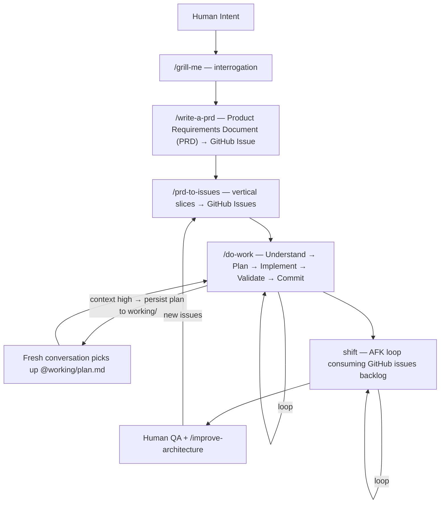

<p align="center">
  
</p>

# ctrl

> Your AI agents, everywhere, autonomous — from a single source of truth.

Claude Code and Copilot give you AI in your editor. They don't give you a system.

ctrl is the system — synced across every machine, scoped to every stack, with a full pipeline from idea to autonomous execution. One `git pull` updates instructions, skills, and shell config everywhere. Context loads only what's relevant to your current project. Secrets stay hardened. And when you walk away, shift keeps shipping.

```bash
git clone https://github.com/arndvs/ctrl.git ~/dotfiles
bash ~/dotfiles/bin/bootstrap.sh
```

---

## The pipeline

Scope a feature. Ship it. Never leave your terminal.



Use any skill individually or chain them. The planning pipeline (grill-me → write-a-prd → prd-to-issues → do-work) hands off between stages.

---

## Continuous workflow

Large tasks outgrow a single conversation. Context degrades — compaction loses nuance, the agent repeats itself, quality drops. ctrl handles this by treating conversations as disposable and plans as persistent.

### How it works

When context gets high, the agent:

1. Commits all current work
2. Writes the remaining plan to `working/<descriptive-name>-plan.md` — slices, acceptance criteria, what's done, what remains
3. Suggests wrapping up and provides a **pickup command** to paste into a fresh conversation

```
@working/production-docs-audit-plan.md — pick up on remaining slices. Start with Slice 2.
```

The new conversation reads the plan file and continues exactly where the old one left off. No re-exploration, no lost context.

### The convention

| Artifact            | Location                   | Purpose                              | Lifecycle                  |
| ------------------- | -------------------------- | ------------------------------------ | -------------------------- |
| `working/*-plan.md` | `working/` in project root | Slice tracking between conversations | Delete after work ships    |
| `research.md`       | Project root               | Cached exploration for broad reuse   | Delete after feature ships |
| GitHub issues       | Remote                     | Permanent record, shift backlog      | Close when done            |

`working/` is gitignored. Plans are working documents — they track progress between conversations, not permanent documentation.

### Example flow

```
Conversation 1:
  "Plan the docs audit" → technical-fellow produces 4 slices
  Implement Slice 1 → commit
  Context getting high → agent writes working/docs-audit-plan.md
  Agent outputs: @working/docs-audit-plan.md — pick up on remaining slices. Start with Slice 2.

Conversation 2:
  Paste the pickup command → agent reads the plan → implements Slice 2
  Implements Slice 3 → context high again → updates the plan file
  Agent outputs: @working/docs-audit-plan.md — pick up on remaining slices. Start with Slice 4.

Conversation 3:
  Paste → Slice 4 → QA → done → delete working/docs-audit-plan.md
```

This is enforced by `global.instructions.md` (the `<handoff>` rules) and built into the `do-work`, `technical-fellow`, `prd-to-issues`, and `research` skills. The agent does this automatically — you don't need to ask.

---

## How it works

### One repo, every machine

Clone `ctrl` to `~/dotfiles` on your local machine, your VPS, anywhere. One `git pull` updates instructions, skills, and shell config everywhere. No drift. No re-setup.

> **How `CLAUDE.md` works:** You edit `CLAUDE.base.md` (tracked in git). `bootstrap.sh` generates `CLAUDE.md` from it by appending `@`-references to any local instruction files in `instructions/_local/`. `CLAUDE.md` is gitignored because it contains machine-specific references — only the generated file is symlinked to `~/.claude/` and read by Claude Code at runtime.

### Progressive disclosure

`detect-context.sh` scans your working directory and exports `ACTIVE_CONTEXTS`. A Next.js project loads Next.js rules. A PHP project loads PHP rules. Nothing leaks between stacks. Agents stay focused.

```
VS Code opens a project
  ↓
CLAUDE.md → global.instructions.md (always loaded)
  ↓
detect-context.sh → ACTIVE_CONTEXTS=general,nextjs,node,typescript,sanity,prisma
  ↓
loads matching instructions/*.md
  ↓
skills/ auto-discovered — workflow + your personal _local/ skills
```

The single setting that makes this work: `"chat.instructionsFilesLocations": {"~/dotfiles": true}` — included in the managed `settings.json` and applied by `sync-settings.sh`.

### Your personal layer, gitignored

`skills/_local/` and `instructions/_local/` are gitignored directories inside the repo. Drop your private, domain-specific, or business-specific skills there. They're auto-discovered by VS Code and Claude Code alongside the public skills — but they never leave your machine unless you push them somewhere private.

```
skills/
├── do-work/           ← public, tracked
├── systematic-debugging/   ← public, tracked
└── _local/            ← GITIGNORED — yours alone
    └── your-skill/SKILL.md
```

### Hardened secrets

Secrets split into two tiers. Agents see config, never credentials.

| File                   | In shell? | Agent-visible? | Contains                    |
| ---------------------- | --------- | -------------- | --------------------------- |
| `secrets/.env.agent`   | Yes       | Yes            | Usernames, hosts, IDs       |
| `secrets/.env.secrets` | No        | No             | API keys, tokens, passwords |

`run-with-secrets.sh` injects credentials into a child process only — they vanish when it exits. For defense in depth, configure Claude Code deny rules to block `env`, `printenv`, `cat secrets/*`, and `echo $*KEY*` at the agent level — `validate-env.sh` warns if these are missing from `~/.claude/settings.json`.

---

## Skills

### Workflow

| Skill                  | What it does                                                                                                                                                                                           |
| ---------------------- | ------------------------------------------------------------------------------------------------------------------------------------------------------------------------------------------------------ |
| `do-work`              | Core execution loop — auto-detects your stack's feedback loops (package.json, Makefile, composer.json, pyproject.toml). Understand → Plan → Implement → Validate → Commit. Not hardcoded to any stack. |
| `grill-me`             | Interrogates you about a plan until reaching shared understanding. One question at a time with recommended answers. Explores the codebase instead of asking when it can.                               |
| `write-a-prd`          | Explores codebase, grills you, sketches deep module interfaces, writes Product Requirements Document (PRD) from template, submits as GitHub issue.                                                     |
| `prd-to-issues`        | Breaks a PRD into vertical slices — each independently shippable. Categorizes HITL vs AFK. Creates GitHub issues with blocking relationships + a QA issue.                                             |
| `technical-fellow`     | Implementation planning — vertical slices, AFK/HITL classification, dependency graphs, acceptance criteria.                                                                                            |
| `skill-scaffolder`     | Meta-skill — scaffolds new agent skills from proven patterns. Interview → architecture matrix → complete directory.                                                                                    |
| `explore`              | Parallel subagent codebase exploration — decomposes a topic, spawns focused sub-agents, synthesizes a unified summary.                                                                                 |
| `research`             | Caches expensive exploration into a persistent `research.md` — staleness checks, lifecycle management, handoff to downstream skills.                                                                   |
| `codebase-audit`       | Ruthless code audit — real problems only, grouped by severity. No manufactured issues, no padding.                                                                                                     |
| `improve-architecture` | Finds shallow-module clusters, spawns parallel design agents, recommends the strongest interface, files a GitHub RFC.                                                                                  |
| `tdd`                  | Red-green refactor — failing test → implement → refactor. Backend only. One test per vertical slice.                                                                                                   |
| `systematic-debugging` | Root-cause-first — investigate → pattern analysis → hypothesis → fix. Stops guess-and-check thrashing.                                                                                                 |

### Your local skills

Add your own to `skills/_local/your-skill/SKILL.md`. Auto-discovered immediately. Gitignored. Can be a private git repo inside the directory if you want version control.

---

## shift: autonomous agent loop

> `ctrl` is the system. `shift` is the worker. **ctrl+shift** — you define the rules, shift executes them.

> **Status: infrastructure ready, testing in HITL mode.**

shift is not a framework. It's a bash loop that runs Claude against your GitHub issues backlog — sandboxed in Docker for AFK mode, direct on host for HITL.

### Two modes

| Mode | Script          | Use when                                                      |
| ---- | --------------- | ------------------------------------------------------------- |
| HITL | `shift/once.sh` | Learning — runs once while you watch                          |
| AFK  | `shift/afk.sh`  | Shipping — loops in Docker sandbox with a max iteration guard |

**HITL:** Claude runs once with `--permission-mode accept-edits` — file edits are auto-accepted, but you can intervene on shell commands and other operations. Start here.

**AFK:** Claude loops inside a [Docker Sandbox](https://docs.docker.com/ai/sandboxes/) (isolated microVM). Each iteration: pick a task → implement → commit → close issue → repeat. Exits when the backlog is empty or max iterations reached.

### How the prompt is built

`_build_prompt.sh` assembles a fresh prompt before each iteration:

1. Fetches open GitHub issues via `gh issue list --state open --json number,title,body,comments`
2. Grabs the last 5 git commits for context
3. Wraps both in XML tags with basic injection sanitization
4. Appends `prompt.md` — task selection priority, skill loading, feedback loops, commit rules

The assembled prompt is written to a temp file and piped via stdin to avoid ARG_MAX limits. Both `afk.sh` and `once.sh` source `_build_prompt.sh` to build `$PROMPT_FILE`.

### Task priority order

1. Critical bugfixes — blockers first
2. Dev infrastructure — tests, types, scripts before features
3. Tracer bullets — small end-to-end slices that validate approach
4. Polish and quick wins
5. Refactors

### How ctrl mounts into the sandbox

The key design: `sbx run` accepts multiple workspace paths. ctrl mounts `~/dotfiles` read-only alongside the target project so the agent gets your full instruction set, skills, and global rules inside the sandbox — without copying anything:

```bash
sbx run claude . ~/dotfiles:ro
```

| Mount               | Access     | Contains                                         |
| ------------------- | ---------- | ------------------------------------------------ |
| `.` (project)       | read-write | The codebase the agent works on                  |
| `~/dotfiles` (ctrl) | read-only  | Instructions, skills, global rules, shift prompt |

Inside the sandbox, `~/.claude/CLAUDE.md` and `~/.claude/skills/` resolve through the symlinks set up by `bootstrap.sh`, which point into `~/dotfiles`. The read-only mount means the agent benefits from every skill and instruction without being able to modify them.

### Docker Sandboxes setup

shift uses [Docker Sandboxes](https://docs.docker.com/ai/sandboxes/) (`sbx` CLI) — lightweight microVMs with their own Docker daemon, filesystem, and network. **Docker Desktop is not required.**

#### shift prerequisites

| Requirement                 | Install                                                                                                                       |
| --------------------------- | ----------------------------------------------------------------------------------------------------------------------------- |
| `sbx` CLI                   | macOS: `brew install docker/tap/sbx` · Windows: download from [sbx-releases](https://github.com/docker/sbx-releases/releases) |
| Windows Hypervisor Platform | `Enable-WindowsOptionalFeature -Online -FeatureName HypervisorPlatform -All` (elevated PowerShell, Windows only)              |
| `gh` (GitHub CLI)           | macOS: `brew install gh` · Windows: `winget install GitHub.cli` · [cli.github.com](https://cli.github.com/)                   |
| `jq`                        | macOS: `brew install jq` · Windows: `winget install jqlang.jq` · [jqlang.github.io/jq](https://jqlang.github.io/jq/download/) |
| Claude subscription         | Claude Max, Team, or Enterprise (for sandbox OAuth)                                                                           |

#### One-time setup

```bash
# 1. Sign in to Docker
sbx login

# 2. Choose a network policy when prompted:
#    Balanced (recommended) — permits common dev services, blocks everything else

# 3. Store GitHub token for the sandbox
sbx secret set -g github -t "$(gh auth token)"

# 4. Verify secrets
sbx secret ls
```

Claude authentication happens inside the sandbox on first run — use the `/login` command when prompted. The session token persists on your host and is injected by a proxy, never stored inside the sandbox.

### Running shift

**Always `cd` into the target project first.** shift operates on the current working directory.

```bash
cd ~/your-project

# HITL — run once while you watch
bash ~/dotfiles/shift/once.sh

# AFK — autonomous loop (default: 5 iterations)
bash ~/dotfiles/shift/afk.sh

# AFK — custom iteration count
bash ~/dotfiles/shift/afk.sh 20
```

The AFK loop exits when:

- Claude outputs `<promise>NO MORE TASKS</promise>` (backlog empty)
- Max iterations reached (default: 5, pass a number as the first argument)

A lock directory (`/tmp/shift-afk.lock`) prevents concurrent runs — a second invocation exits immediately with "shift already running".

### Branch mode (optional)

By default, shift commits directly to your working tree. For safer AFK runs, use `--branch` to give the agent its own git worktree:

```bash
# Edit afk.sh to add --branch auto:
sbx run --name shift-afk --branch auto claude . ~/dotfiles:ro -- ...
```

This creates a worktree under `.sbx/` in your project root. Review changes before merging:

```bash
cd .sbx/<sandbox-name>-worktrees/<branch>
git log
git push -u origin <branch>
gh pr create
```

Add `.sbx/` to your project's `.gitignore` or global gitignore when using branch mode.

### Managing sandboxes

```bash
sbx ls                         # list running sandboxes
sbx stop <name>                # pause (installed packages, config preserved)
sbx rm <name>                  # delete (reclaims disk)
sbx exec -it <name> bash       # shell into a running sandbox
sbx policy ls                  # check network rules
sbx policy allow network <host> # allow a blocked host
```

### Activation checklist

- [ ] `sbx` CLI installed and `sbx login` completed
- [ ] `sbx secret set -g github -t "$(gh auth token)"` — GitHub access for the sandbox
- [ ] `gh` CLI installed and authenticated (`gh auth login`)
- [ ] `jq` installed
- [ ] Claude Max/Team/Enterprise subscription
- [ ] `bootstrap.sh` run (symlinks `~/.claude/CLAUDE.md` and `~/.claude/skills/`)
- [ ] 5–10 well-formed GitHub issues ready
- [ ] Start HITL → graduate to AFK (1 iteration) → scale up

---

## What's in the box

```
~/dotfiles/
├── CLAUDE.base.md                   ← edit this — bootstrap generates CLAUDE.md from it
├── CLAUDE.md                        ← GENERATED (gitignored)
├── global.instructions.md           ← universal rules, always loaded
├── settings.json                    ← managed VS Code settings
├── .env.agent.example               ← template for non-sensitive config
├── .env.citation.example            ← template for citation skill config
├── .env.secrets.example             ← template for API keys and tokens
├── .gitignore
├── dotfiles.code-workspace
├── instructions/
│   ├── nextjs.instructions.md
│   ├── php.instructions.md
│   ├── sanity.instructions.md
│   ├── sentry.instructions.md
│   ├── google-docs.instructions.md
│   ├── css.instructions.md
│   ├── ux-prototyping.instructions.md
│   └── _local/                      ← GITIGNORED — your private instructions
├── skills/
│   ├── do-work/
│   ├── grill-me/
│   ├── write-a-prd/
│   ├── prd-to-issues/
│   ├── technical-fellow/
│   ├── skill-scaffolder/
│   ├── explore/
│   ├── research/
│   ├── codebase-audit/
│   ├── improve-architecture/
│   ├── tdd/
│   ├── systematic-debugging/
│   └── _local/                      ← GITIGNORED — your private skills
├── shift/
│   ├── afk.sh                       AFK autonomous loop
│   ├── once.sh                      HITL single-run
│   ├── _build_prompt.sh             shared prompt builder (sourced by afk/once)
│   └── prompt.md                    shared agent prompt
├── bin/
│   ├── _lib.sh                      shared utility functions
│   ├── bootstrap.sh                 one-command setup, idempotent
│   ├── agent-shell.sh               launches secrets-free shell for agent sessions
│   ├── sync-settings.sh             merge VS Code settings
│   ├── load-secrets.sh              sources .env.agent into shell
│   ├── run-with-secrets.sh          injects .env.secrets into child process
│   ├── detect-context.sh            exports ACTIVE_CONTEXTS
│   └── validate-env.sh              validates env vars and hardening posture
├── assets/                          ← images (logo, etc.)
├── working/                         ← GITIGNORED — scratch/temp files for long ops
└── secrets/                         ← GITIGNORED
    ├── .env.agent
    ├── .env.secrets
    └── .venv/
```

<details>
<summary>Context detection signals</summary>

`detect-context.sh` scans the current directory for these file signatures:

| Signal       | File                                                          | Context        |
| ------------ | ------------------------------------------------------------- | -------------- |
| Next.js      | `next.config.{ts,js,mjs}`                                     | `nextjs`       |
| React Native | `"react-native"` in `package.json`                            | `react-native` |
| React        | `"react"` in `package.json` (if not Next/Native)              | `react`        |
| Node         | `package.json`                                                | `node`         |
| TypeScript   | `tsconfig.json`                                               | `typescript`   |
| PHP          | `composer.json`                                               | `php`          |
| Sanity       | `sanity.config.{ts,js,mjs,mts}`, `sanity.cli.{ts,js}`        | `sanity`       |
| Prisma       | `prisma/schema.prisma`                                        | `prisma`       |
| Docker       | `Dockerfile`, `docker-compose.yml/.yaml`, `compose.yml/.yaml` | `docker`       |
| Python       | `requirements.txt`, `pyproject.toml`, `setup.py`, `Pipfile`   | `python`       |
| Laravel      | `artisan`                                                     | `laravel`      |

A `general` context is always set as the baseline — it ensures skills without a specific context trigger still load.

Not all contexts have dedicated instruction files yet — detection scopes skill loading and can trigger custom instructions you add.

</details>

### Key VS Code settings

| Setting                                               | Value                                                | Why                                                  |
| ----------------------------------------------------- | ---------------------------------------------------- | ---------------------------------------------------- |
| `chat.instructionsFilesLocations`                     | `{"~/dotfiles": true, ".github/instructions": true}` | Enables the entire instruction/skill discovery chain |
| `chat.agent.maxRequests`                              | `100000`                                             | Prevents agent from stopping mid-task                |
| `github.copilot.chat.anthropic.thinking.budgetTokens` | `32000`                                              | Extended thinking for complex reasoning              |
| `chat.exploreAgent.defaultModel`                      | `Claude Opus 4.6 (copilot)`                          | Model selection for explore subagent                 |

---

## Installation

> **Before you install:** Bootstrap is mostly idempotent but touches several dotfiles:
>
> - **`~/.claude/CLAUDE.md`** — replaced with a symlink (or overwritten on Windows). Back up if you have a custom one.
> - **`~/.claude/skills/`** — symlinked if absent or a stale link. Existing real directories are left alone (manual merge message shown).
> - **`~/.bashrc` / `~/.zshrc`** — appends shell integration (load-secrets + context detection). Idempotent on re-runs.
> - **`~/.npmrc`** — appends `min-release-age=7` for supply chain protection.
> - **`~/.config/uv/uv.toml`** — adds `exclude-newer` date for supply chain protection.
>
> **Not run by bootstrap:** `sync-settings.sh` (VS Code settings merge) is a separate manual step. Run with `--dry-run` first to preview changes.

<details>
<summary>Quick setup (recommended)</summary>

```bash
git clone https://github.com/arndvs/ctrl.git ~/dotfiles
bash ~/dotfiles/bin/bootstrap.sh
```

Bootstrap is idempotent — safe to re-run. It handles:

- Generating `CLAUDE.md` from `CLAUDE.base.md` + your local instruction files
- Creating `secrets/.env.agent` and `secrets/.env.secrets` from templates
- Symlinking `~/.claude/CLAUDE.md` and `~/.claude/skills/`
- Creating `skills/_local/` and `instructions/_local/`
- Wiring `load-secrets.sh` and `detect-context.sh` into `~/.bashrc` / `~/.zshrc`
- Appending `min-release-age=7` to `~/.npmrc` (supply chain protection)
- Adding `exclude-newer` to `~/.config/uv/uv.toml` (supply chain protection)
- Creating the Python venv

After bootstrap:

```bash
$EDITOR ~/dotfiles/secrets/.env.agent       # non-sensitive config
$EDITOR ~/dotfiles/secrets/.env.secrets     # API keys and tokens
bash ~/dotfiles/bin/sync-settings.sh        # merge VS Code settings
source ~/.bashrc
```

> **Windows:** file symlinks require admin. Bootstrap falls back to copying `CLAUDE.md` and prints upgrade instructions. Directory symlinks work via Developer Mode.

</details>

<details>
<summary>VPS setup</summary>

Same as local — but skip `sync-settings.sh`. VS Code Remote SSH forwards your local settings automatically.

```bash
git clone https://github.com/arndvs/ctrl.git ~/dotfiles
bash ~/dotfiles/bin/bootstrap.sh
$EDITOR ~/dotfiles/secrets/.env.agent
$EDITOR ~/dotfiles/secrets/.env.secrets
source ~/.bashrc
```

Verify:

```bash
readlink ~/.claude/CLAUDE.md     # → ~/dotfiles/CLAUDE.md
readlink ~/.claude/skills        # → ~/dotfiles/skills
echo $GITHUB_USERNAME
cd ~/some-project && echo $ACTIVE_CONTEXTS
```

</details>

<details>
<summary>Manual setup</summary>

```bash
# 1. Clone
git clone https://github.com/arndvs/ctrl.git ~/dotfiles

# 2. Generate CLAUDE.md and symlink
bash ~/dotfiles/bin/bootstrap.sh   # or manually:
mkdir -p ~/.claude
ln -sf ~/dotfiles/CLAUDE.md ~/.claude/CLAUDE.md
ln -sf ~/dotfiles/skills ~/.claude/skills

# 3. Secrets
cp ~/dotfiles/.env.agent.example ~/dotfiles/secrets/.env.agent
cp ~/dotfiles/.env.secrets.example ~/dotfiles/secrets/.env.secrets

# 4. Shell integration — add to ~/.bashrc
[[ -f ~/dotfiles/bin/load-secrets.sh ]] && source ~/dotfiles/bin/load-secrets.sh
_load_context() { [[ -f ~/dotfiles/bin/detect-context.sh ]] && source ~/dotfiles/bin/detect-context.sh > /dev/null 2>&1; }
cd() { builtin cd "$@" && _load_context; }
_load_context

# 5. VS Code settings
bash ~/dotfiles/bin/sync-settings.sh
```

</details>

---

## Customization

| Want to...                | Do this                                                                                                                                     |
| ------------------------- | ------------------------------------------------------------------------------------------------------------------------------------------- |
| Add a new stack           | Create `instructions/yourstack.instructions.md`, add detection to `detect-context.sh`, reference in `CLAUDE.base.md`, re-run `bootstrap.sh` |
| Add a public skill        | Create `skills/your-skill/SKILL.md` — auto-discovered                                                                                       |
| Add a private skill       | Create `skills/_local/your-skill/SKILL.md` — auto-discovered, gitignored                                                                    |
| Add a private instruction | Create `instructions/_local/your-topic.instructions.md`, re-run `bootstrap.sh`                                                              |
| Add config                | Add key to `.env.agent.example`, value to `secrets/.env.agent`                                                                              |
| Add a secret              | Add key to `.env.secrets.example`, value to `secrets/.env.secrets`                                                                          |

## Updating

```bash
cd ~/dotfiles && git pull
bash ~/dotfiles/bin/bootstrap.sh        # re-validates, fixes stale symlinks
bash ~/dotfiles/bin/sync-settings.sh    # local only — skip on VPS
source ~/.bashrc
```

---

## Troubleshooting

<details>
<summary>Common issues</summary>

**Instructions not loading in Copilot Chat**

- `readlink ~/.claude/CLAUDE.md` — should point to `~/dotfiles/CLAUDE.md`
- If not a symlink, re-run `bash ~/dotfiles/bin/bootstrap.sh`
- Verify `chat.instructionsFilesLocations` has `"~/dotfiles": true`

**`secrets/.env.agent not found` on shell startup**

- `cp ~/dotfiles/.env.agent.example ~/dotfiles/secrets/.env.agent`
- Fill it in: `$EDITOR ~/dotfiles/secrets/.env.agent`

**`sync-settings.sh` fails on VPS**

- Expected. VS Code Remote SSH forwards local settings — don't run sync on VPS.

**`ACTIVE_CONTEXTS` empty**

- `grep "detect-context" ~/.bashrc` — if missing, re-run bootstrap
- Detection runs on `cd` — navigate into a project first

**Python venv broken**

- `rm -rf ~/dotfiles/secrets/.venv && bash ~/dotfiles/bin/bootstrap.sh`

**shift: `sbx: command not found`**

- Install the `sbx` CLI: macOS `brew install docker/tap/sbx`, Windows download from [sbx-releases](https://github.com/docker/sbx-releases/releases)
- `sbx` is a standalone tool — Docker Desktop is not required

**shift: `gh: command not found` or empty issue list**

- Install GitHub CLI: `brew install gh` or [cli.github.com](https://cli.github.com/)
- Authenticate: `gh auth login`
- Verify: `gh issue list` in the target project

**shift: sandbox can't reach GitHub or APIs**

- Check network policy: `sbx policy ls`
- Allow a blocked host: `sbx policy allow network <hostname>`
- Balanced policy (chosen during `sbx login`) permits common dev services by default

**shift: Claude not authenticated inside sandbox**

- On first run, use `/login` when Claude prompts for authentication
- The session token persists across sandbox restarts
- Alternatively: `sbx secret set -g anthropic` to use an API key

**shift: skills/instructions not available in sandbox**

- Verify `bootstrap.sh` was run (`readlink ~/.claude/CLAUDE.md` should point to `~/dotfiles/CLAUDE.md`)
- The AFK script mounts `~/dotfiles:ro` — check the mount is correct in `afk.sh`
- Shell into the sandbox to verify: `sbx exec -it <name> bash`, then `ls ~/dotfiles/`

</details>

---

## Prerequisites

- [VS Code](https://code.visualstudio.com/) (stable or Insiders)
- [GitHub Copilot](https://github.com/features/copilot) (optional — enhances agent mode but ctrl works with Claude Code alone)
- Git Bash (Windows) or bash (Linux/macOS)
- Python 3.10+
- [`sbx` CLI](https://docs.docker.com/ai/sandboxes/get-started/) (for shift AFK mode — Docker Desktop not required)
- [GitHub CLI (`gh`)](https://cli.github.com/) (for shift — fetches issues for the prompt)
- `jq` (for shift — parses Claude's stream-json output)

---

> **Naming conventions:** The GitHub repo is `arndvs/ctrl` but the on-disk path is `~/dotfiles` — hardcoded across 40+ references. Clone it to `~/dotfiles` and leave it there.
