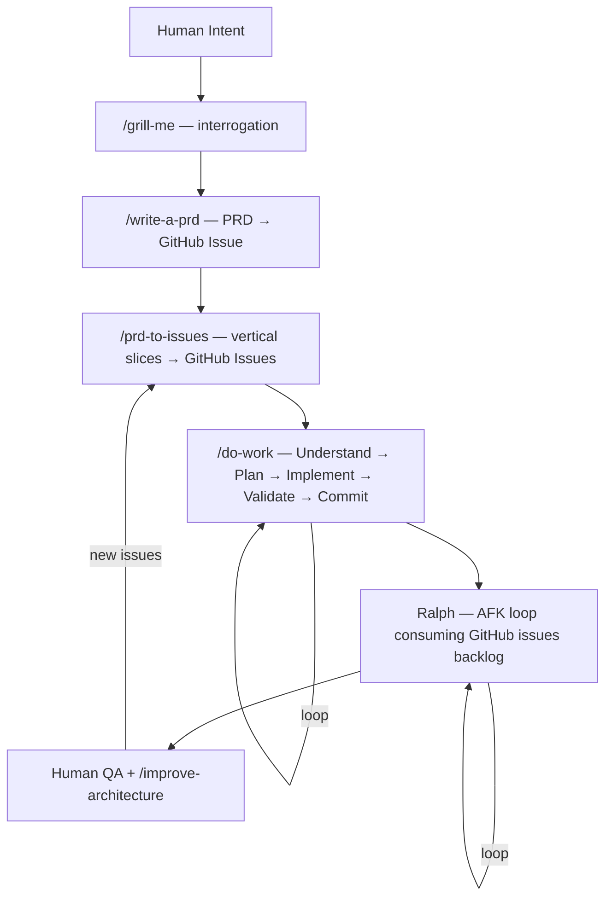

# AI Dotfiles

Agent orchestration infrastructure for running multiple autonomous AI agents in parallel across local machines and VPS instances — from a single source of truth.

Clone to `~/dotfiles` on every machine. One `git pull` updates instructions, skills, and shell config everywhere. Agents only load what's relevant to the current workspace (progressive disclosure). The endgame: Ralph loops consuming GitHub issues backlogs autonomously while you review and add new work.

Forked from [kangarko/ai-files](https://github.com/kangarko/ai-files) and extended with environment hardening, cross-machine secret management, auto-context detection, workflow skills, and autonomous agent infrastructure.

## Architecture



```
VS Code opens any project
  ↓
chat.instructionsFilesLocations: {"~/dotfiles": true}
  ↓ discovers
CLAUDE.md → @global.instructions.md → conditional @instructions/*.md
  ↓ based on workspace files
detect-context.sh → ACTIVE_CONTEXTS=nextjs,prisma,sanity
  ↓ agents load only matching skills
skills/do-work/SKILL.md, skills/grill-me/SKILL.md, etc.
```

**Claude Code (CLI)** reads `~/.claude/CLAUDE.md` which references the same instruction files via `@` paths.

**VS Code Copilot** discovers instructions and skills by scanning the `~/dotfiles` tree via the `chat.instructionsFilesLocations` setting.

## Workflow

The workflow skills compose into a pipeline. Use them individually or as a full sequence.

### Planning Phase

1. **`/grill-me`** — Interview you relentlessly about a plan or design until reaching shared understanding. Asks questions one at a time with recommended answers. If a question can be answered by exploring the codebase, it explores instead of asking.

2. **`/write-a-prd`** — Explores the codebase, grills you about the problem, then writes a PRD from a template and submits it as a GitHub issue. Sections: problem statement, solution, user stories, implementation decisions, schema changes, testing, out of scope.

3. **`/prd-to-issues`** — Breaks a PRD into independently grabbable GitHub issues using vertical slices (tracer bullets). Each slice wires through all layers end-to-end. Categorizes slices as AFK or HITL. Creates a final QA issue with a manual verification plan. Sets up blocking relationships between issues.

### Execution Phase

4. **`/do-work`** — Core execution loop: Understand → Plan (optional, skip if already planned) → Implement → Validate → Commit. Auto-detects feedback loops from the workspace (package.json scripts, composer.json, Makefile, pyproject.toml). Not hardcoded to any stack.

### Review & Improve

5. **`/improve-architecture`** — Explores the codebase for shallow-module clusters (interface nearly as complex as implementation). Presents candidates, spawns parallel subagents to produce diverse interface designs, recommends the strongest option, creates a GitHub issue RFC.

### Autonomous Execution (Ralph)

> **Status: Infrastructure ready, activation pending.** See [Ralph section](#ralph-autonomous-agent-loop) below.

Ralph is a bash loop that runs Claude autonomously inside a Docker sandbox, consuming a GitHub issues backlog. The agent picks the highest-priority task, implements it, commits, closes/comments on the issue, and loops until the backlog is empty.

## What's In The Box

```
~/dotfiles/
├── CLAUDE.md                        ← entry point — routes to instructions
├── global.instructions.md           ← universal coding rules (81 lines, always loaded)
├── settings.json                    ← VS Code settings (~220 settings)
├── instructions/                    ← conditionally loaded per workspace
│   ├── nextjs.instructions.md           Next.js 16 / TypeScript / React 19 / JS rules
│   ├── php.instructions.md              PHP 8.4+ OOP
│   ├── sanity.instructions.md           Sanity CMS MCP tools reference
│   ├── sentry.instructions.md          Sentry MCP tools reference
│   ├── google-docs.instructions.md      Google API (Sheets, Docs, Slides, Drive)
│   ├── css.instructions.md              CSS nesting, container queries, modern patterns
│   ├── copywriting.instructions.md      Ad copy, email sequences, headline formulas, design
│   ├── codebase-audit.instructions.md   Audit methodology
│   ├── exploration.instructions.md      Codebase exploration and investigation
│   ├── technical-fellow.instructions.md Technical fellow planning role
│   └── atomic-commits.instructions.md   Atomic commit workflow rules
├── skills/                          ← auto-discovered by VS Code
│   ├── do-work/                         core execution loop
│   ├── grill-me/                        pre-planning interrogation
│   ├── write-a-prd/                     PRD authoring → GitHub issue
│   ├── prd-to-issues/                   PRD → vertical slices → GitHub issues
│   ├── improve-architecture/            codebase health → RFC issues
│   ├── tdd/                             red-green refactor (backend-only)
│   ├── citation-builder-skill/          automated SEO citation building pipeline
│   ├── github-weekly-digest/            GitHub commits → AI → blog post → Sanity CMS
│   ├── portfolio-showcaser/             browser-driven portfolio screenshots + reports
│   ├── skill-scaffolder/                meta-skill for creating new agent skills
│   └── systematic-debugging/            root-cause-first debugging methodology
├── prompts/                         ← reusable prompt templates
│   ├── codebase-audit.txt               ruthless audit prompt
│   └── technical-fellow.md              tracer-bullet-aware planning format
├── bin/                             ← shell scripts sourced in .bashrc
│   ├── bootstrap.sh                     one-command setup for a fresh machine
│   ├── sync-settings.sh                 merge VS Code settings from dotfiles
│   ├── load-secrets.sh                  sources secrets/.env.agent into shell
│   ├── run-with-secrets.sh              injects secrets/.env.secrets into child process
│   ├── detect-context.sh                auto-detects project type → ACTIVE_CONTEXTS
│   └── validate-env.sh                  validates env vars and hardening posture
├── secrets/                         ← GITIGNORED — per-machine secrets
│   ├── .env.agent                       non-sensitive config
│   ├── .env.secrets                     credentials/tokens (process-scoped)
│   ├── *.json                           GCP service account credentials
│   └── .venv/                           shared Python venv
└── working/                         ← GITIGNORED — scratch files
```

### Skills

#### Workflow Skills

| Skill                  | Purpose                                                                                                                              |
| ---------------------- | ------------------------------------------------------------------------------------------------------------------------------------ |
| `do-work`              | Core execution loop — Understand → Plan → Implement → Validate → Commit → Context Check. Auto-detects feedback loops per stack.      |
| `grill-me`             | Pre-planning interrogation — one question at a time with recommended answers. Explores codebase to answer questions when possible.   |
| `write-a-prd`          | PRD authoring — explores codebase, grills user, sketches modules (deep module analysis), writes PRD from template → GitHub issue.    |
| `prd-to-issues`        | PRD decomposition — breaks PRD into vertical slices, categorizes HITL/AFK, creates GitHub issues with dependency graph + QA issue.   |
| `improve-architecture` | Codebase health — identifies shallow modules, spawns parallel design agents, recommends interface improvements via GitHub issue RFC. |
| `tdd`                  | Red-green refactor — write failing test → implement → refactor. Backend-only. One test per vertical slice, one slice at a time.      |

#### Automation Skills

| Skill                    | Purpose                                                                                                                                             |
| ------------------------ | --------------------------------------------------------------------------------------------------------------------------------------------------- |
| `citation-builder-skill` | Automated local SEO citation building — browser form automation, Google Sheets tracking, email verification, NAP accuracy scoring.                  |
| `github-weekly-digest`   | "What I shipped" pipeline — GitHub commits → per-repo AI analysis → narrative blog post → Sanity CMS draft. Daily/weekly/rollup cadences.           |
| `portfolio-showcaser`    | Browser-driven portfolio analysis — code analysis, feature discovery, 4-axis scoring, dev server interaction, screenshot capture.                   |
| `skill-scaffolder`       | Meta-skill for creating new agent skills — generates complete skill directories following proven patterns.                                          |
| `systematic-debugging`   | Root-cause-first debugging — four-phase process (investigate → pattern analysis → hypothesis → implementation). Prevents guess-and-check thrashing. |

**Third-party skills** (installed via `find-skills`) live in `~/.agents/skills/` and are symlinked into `~/.copilot/skills/`. Not tracked in this repo.

### Instruction Files

`CLAUDE.md` always loads `global.instructions.md` first, then conditionally loads domain-specific files:

| File                               | Loads when          | What it enforces                                                                                                              |
| ---------------------------------- | ------------------- | ----------------------------------------------------------------------------------------------------------------------------- |
| `global.instructions.md`           | Always              | DRY, no comments, early returns, strict validation, env-var-only secrets, skill self-learning, code formatting, deep thinking |
| `nextjs.instructions.md`           | Next.js project     | Next.js 16 / React 19 / TypeScript / JS patterns                                                                              |
| `php.instructions.md`              | PHP project         | PHP 8.4+ strict OOP                                                                                                           |
| `sanity.instructions.md`           | Sanity project      | Sanity MCP server reference                                                                                                   |
| `sentry.instructions.md`           | Sentry tasks        | Sentry MCP server reference                                                                                                   |
| `google-docs.instructions.md`      | Google API tasks    | Service account auth, Sheets/Docs/Slides/Drive API                                                                            |
| `css.instructions.md`              | CSS / frontend UI   | CSS nesting, container queries, logical properties, subgrid                                                                   |
| `copywriting.instructions.md`      | Copy / ads / design | Ad structure, headline formulas, email sequences, design taste                                                                |
| `codebase-audit.instructions.md`   | Audit tasks         | Points to `prompts/codebase-audit.txt`                                                                                        |
| `exploration.instructions.md`      | "explore" tasks     | Multi-subagent codebase exploration methodology                                                                               |
| `technical-fellow.instructions.md` | "technical fellow"  | Tracer-bullet-aware planning with HITL/AFK classification                                                                     |
| `atomic-commits.instructions.md`   | "atomic commits"    | One logical change per commit, conventional commit messages                                                                   |

### Environment Hardening

Secrets are split into two tiers — agents see config but never credentials:

| File                   | Sourced into shell?         | Agent-visible?     | Contents                                 |
| ---------------------- | --------------------------- | ------------------ | ---------------------------------------- |
| `secrets/.env.agent`   | Yes (via `load-secrets.sh`) | Yes (in shell env) | Usernames, hosts, spreadsheet IDs, flags |
| `secrets/.env.secrets` | **No**                      | **No**             | API keys, tokens, passwords              |

**How secrets reach scripts:**

1. `load-secrets.sh` sources **only** `.env.agent` into the shell (added to `.bashrc`)
2. Scripts that need credentials run via `bin/run-with-secrets.sh`:
   ```bash
   ~/dotfiles/bin/run-with-secrets.sh python scripts/sheets_client.py
   ```
   This injects `.env.secrets` into the child process only — secrets vanish when it exits
3. Scripts read everything from `os.environ` / `process.env` / `$VAR`
4. If missing → hard error naming the var and pointing to the appropriate `.example` file

**Agent-level protections:**

- Claude Code deny rules in `~/.claude/settings.json` block `env`, `printenv`, `cat secrets/*`, and `echo $*KEY*` patterns
- Secrets never in shell environment — agents can't accidentally inherit them
- `bin/validate-env.sh` checks that secrets are NOT leaking into the shell

### Context Detection

`bin/detect-context.sh` scans the current directory for file signatures and exports `ACTIVE_CONTEXTS`:

| Signal       | File                                             | Context        |
| ------------ | ------------------------------------------------ | -------------- |
| Next.js      | `next.config.*`                                  | `nextjs`       |
| React Native | `"react-native"` in `package.json`               | `react-native` |
| React        | `"react"` in `package.json` (if not Next/Native) | `react`        |
| Node         | `package.json`                                   | `node`         |
| TypeScript   | `tsconfig.json`                                  | `typescript`   |
| PHP          | `composer.json`                                  | `php`          |
| Sanity       | `sanity.config.*`, `sanity.cli.*`                | `sanity`       |
| Prisma       | `prisma/schema.prisma`                           | `prisma`       |
| Docker       | `Dockerfile`, `docker-compose.*`                 | `docker`       |
| Python       | `requirements.txt`, `pyproject.toml`, `setup.py` | `python`       |
| Laravel      | `artisan`                                        | `laravel`      |

The `.bashrc` integration re-runs detection on every `cd`.

### Key VS Code Settings

| Setting                                               | Value                  | Why                                                  |
| ----------------------------------------------------- | ---------------------- | ---------------------------------------------------- |
| `chat.instructionsFilesLocations`                     | `{"~/dotfiles": true}` | Enables the entire instruction/skill discovery chain |
| `chat.agent.maxRequests`                              | `100000`               | Prevents agent from stopping mid-task                |
| `github.copilot.chat.anthropic.thinking.budgetTokens` | `32000`                | Extended thinking for complex reasoning              |
| `github.copilot.chat.responsesApiReasoningEffort`     | `xhigh`                | Maximum reasoning effort                             |
| `chat.exploreAgent.defaultModel`                      | `Claude Opus 4.6`      | Model selection for explore subagent                 |
| `claudeCode.allowDangerouslySkipPermissions`          | `true`                 | Claude Code auto-approve                             |

## Ralph: Autonomous Agent Loop

> **Status: Infrastructure ready, activation pending.**

The entire dotfiles infrastructure — symlinks across machines, bootstrap.sh idempotency, run-with-secrets.sh process isolation, VPS setup, Docker context detection — was built for autonomous parallel agents.

### What Is Ralph

Ralph is a loop. You run Claude in a bash loop with a shared prompt, consuming a backlog until tasks are complete. Not a framework — just a `for` loop around `claude --print` inside a Docker sandbox.

### HITL vs AFK

Two modes sharing the same prompt:

- **HITL** (`ralph/once.sh`) — runs Claude once while you watch. Use this first to build confidence.
- **AFK** (`ralph/afk.sh`) — loops autonomously with a max iteration guard. Claude picks a task, implements it, commits, closes/comments on the issue, then picks the next one. Exits when backlog is empty (`<promise>NO MORE TASKS</promise>`).

### Docker Sandboxing

`--dangerously-skip-permissions` needs containment. Docker sandbox isolates Claude in a micro-VM — can't reach host filesystem. Agent can run commands, write files, use git, but damage is contained.

```bash
docker sandbox run claude .
```

### GitHub Issues as Backlog

Instead of passing a PRD file, pass all open issues. Ralph does task selection using this priority order:

1. **Critical bugfixes** — bugs can block other work
2. **Development infrastructure** — tests, types, dev scripts need to be solid before features
3. **Tracer bullets for new features** — small end-to-end slices that validate approach
4. **Polish and quick wins** — small improvements and additions
5. **Refactors** — code cleanup and improvements

The agent picks, implements, commits, closes/comments on the issue, loops. Human reviews async, adds new issues. This happens in parallel.

### Activation Checklist

- [ ] Claude Max subscription (for autonomous usage)
- [ ] Docker Desktop installed on execution machines
- [ ] `ralph/` directory with `once.sh`, `afk.sh`, `prompt.md`
- [ ] GitHub CLI authenticated in Docker sandbox (`gh auth login`)
- [ ] Deny rules validated in sandbox environment
- [ ] At least 5-10 well-formed GitHub issues to test with
- [ ] Start HITL → graduate to AFK (max 1 iteration) → scale up

## Installation

<details>
<summary>Quick Setup (Recommended)</summary>

```bash
git clone https://github.com/arndvs/dotfiles.git ~/dotfiles
bash ~/dotfiles/bin/bootstrap.sh
```

The bootstrap script is idempotent (safe to re-run) and handles:

- Creating `secrets/.env.agent` and `secrets/.env.secrets` from templates
- Symlinking `~/.claude/CLAUDE.md` and `~/.claude/skills/`
- Wiring `load-secrets.sh` and `detect-context.sh` into `~/.bashrc`
- Creating the Python venv with base Google API packages

After running, fill in your config and secrets, then merge VS Code settings:

```bash
$EDITOR ~/dotfiles/secrets/.env.agent      # non-sensitive config (usernames, hosts, IDs)
$EDITOR ~/dotfiles/secrets/.env.secrets    # API keys, tokens, passwords
bash ~/dotfiles/bin/sync-settings.sh --dry-run   # preview changes
bash ~/dotfiles/bin/sync-settings.sh              # merge into VS Code Insiders
source ~/.bashrc
```

> On Windows, file symlinks require admin. The bootstrap copies `CLAUDE.md` instead and prints instructions for upgrading to a symlink. Directory symlinks (`~/.claude/skills/`) work without admin via Developer Mode.

</details>

<details>
<summary>VPS Setup</summary>

Clone and bootstrap — same as local, but **do not run `sync-settings.sh` on the VPS**. VS Code Remote SSH forwards your local settings automatically.

```bash
git clone https://github.com/arndvs/dotfiles.git ~/dotfiles
bash ~/dotfiles/bin/bootstrap.sh
$EDITOR ~/dotfiles/secrets/.env.agent          # fill in non-sensitive config
$EDITOR ~/dotfiles/secrets/.env.secrets        # fill in API keys
source ~/.bashrc
```

| Concern               | Local machine                | VPS                                 |
| --------------------- | ---------------------------- | ----------------------------------- |
| VS Code settings      | Run `sync-settings.sh`       | Forwarded via Remote SSH            |
| `~/.claude/CLAUDE.md` | Symlink (or copy on Windows) | Symlink                             |
| `secrets/.env.*`      | Your local API keys          | Same keys or VPS-specific overrides |
| Python venv           | Created by bootstrap         | Created by bootstrap                |

**VPS verification:**

```bash
readlink ~/.claude/CLAUDE.md        # should point to ~/dotfiles/CLAUDE.md
readlink ~/.claude/skills           # should point to ~/dotfiles/skills
echo $GITHUB_USERNAME               # should print your username
cd ~/some-project && echo $ACTIVE_CONTEXTS
```

</details>

<details>
<summary>Manual Setup</summary>

#### 1. Clone

```bash
git clone https://github.com/arndvs/dotfiles.git ~/dotfiles
```

#### 2. Symlink

```bash
mkdir -p ~/.claude
ln -sf ~/dotfiles/CLAUDE.md ~/.claude/CLAUDE.md
ln -sf ~/dotfiles/skills ~/.claude/skills
```

#### 3. Secrets

```bash
mkdir -p ~/dotfiles/secrets
cp ~/dotfiles/.env.agent.example ~/dotfiles/secrets/.env.agent
cp ~/dotfiles/.env.secrets.example ~/dotfiles/secrets/.env.secrets
```

#### 4. Shell integration

Add to `~/.bashrc`:

```bash
[[ -f ~/dotfiles/bin/load-secrets.sh ]] && source ~/dotfiles/bin/load-secrets.sh

_load_context() {
    [[ -f ~/dotfiles/bin/detect-context.sh ]] \
        && source ~/dotfiles/bin/detect-context.sh > /dev/null 2>&1
}
cd() { builtin cd "$@" && _load_context; }
_load_context
```

#### 5. VS Code settings

```bash
bash ~/dotfiles/bin/sync-settings.sh
```

The critical setting: `"chat.instructionsFilesLocations": {"~/dotfiles": true}`

#### 6. Python venv

```bash
python3 -m venv ~/dotfiles/secrets/.venv
source ~/dotfiles/secrets/.venv/bin/activate
pip install google-auth google-auth-httplib2 google-api-python-client
```

</details>

### Verify

```bash
bash ~/dotfiles/bin/validate-env.sh        # core vars only
bash ~/dotfiles/bin/validate-env.sh --all  # core + citation builder vars
echo $GITHUB_USERNAME                      # check secrets loaded
cd ~/your-nextjs-project && echo $ACTIVE_CONTEXTS
```

## Scripts Reference

| Script                    | Purpose                                                       | Flags                   |
| ------------------------- | ------------------------------------------------------------- | ----------------------- |
| `bin/bootstrap.sh`        | One-command machine setup — secrets, symlinks, shell, venv    | (none)                  |
| `bin/sync-settings.sh`    | Merge `settings.json` into VS Code user settings              | `--dry-run`, `--stable` |
| `bin/load-secrets.sh`     | Source `secrets/.env.agent` (non-sensitive config) into shell | (sourced, not run)      |
| `bin/run-with-secrets.sh` | Inject `secrets/.env.secrets` into a child process at runtime | (wraps a command)       |
| `bin/detect-context.sh`   | Detect project type, export `ACTIVE_CONTEXTS`                 | (sourced, not run)      |
| `bin/validate-env.sh`     | Validate env vars and hardening posture                       | `--all`                 |

## Customization

- **Add a new stack?** Create `instructions/yourstack.instructions.md`, add a conditional `@` reference in `CLAUDE.md`, and add detection to `bin/detect-context.sh`
- **Add a skill?** Create `skills/your-skill/SKILL.md` — VS Code discovers it automatically via the `instructionsFilesLocations` setting
- **Add a workflow skill?** Same as above, but update the Workflow section in this README
- **New config?** Add the key to `.env.agent.example`, add the value to `secrets/.env.agent`
- **New secrets?** Add the key to `.env.secrets.example`, add the value to `secrets/.env.secrets`
- **Remove a stack?** Delete its instruction file and remove the `@` reference from `CLAUDE.md`

## Updating

```bash
cd ~/dotfiles && git pull
bash ~/dotfiles/bin/bootstrap.sh        # re-validates symlinks, creates missing files
bash ~/dotfiles/bin/sync-settings.sh    # merge any new VS Code settings (LOCAL only)
source ~/.bashrc                        # pick up any new env vars
```

On a VPS, skip `sync-settings.sh`.

## Troubleshooting

<details>
<summary>Common issues</summary>

**Instructions not loading in Copilot Chat**

- Verify the symlink: `readlink ~/.claude/CLAUDE.md` — should point to `~/dotfiles/CLAUDE.md`
- If it's a regular file, re-run `bash ~/dotfiles/bin/bootstrap.sh`
- Check that `chat.instructionsFilesLocations` includes `"~/dotfiles": true`

**`secrets/.env.agent not found` warning on shell startup**

- Run: `cp ~/dotfiles/.env.agent.example ~/dotfiles/secrets/.env.agent`
- Fill in config: `$EDITOR ~/dotfiles/secrets/.env.agent`

**`sync-settings.sh` fails on VPS**

- Expected — VS Code Remote SSH forwards your local settings automatically

**`ACTIVE_CONTEXTS` not set / empty**

- Verify: `grep "detect-context" ~/.bashrc`
- If missing, re-run `bash ~/dotfiles/bin/bootstrap.sh`
- Detection runs on `cd` — it reads the current directory's files

**Python venv missing or broken**

- Delete and recreate: `rm -rf ~/dotfiles/secrets/.venv && bash ~/dotfiles/bin/bootstrap.sh`

</details>

## Prerequisites

- [VS Code Insiders](https://code.visualstudio.com/insiders/)
- [GitHub Copilot](https://github.com/features/copilot) subscription
- Git Bash (Windows) or bash (Linux/macOS)
- Python 3.10+ (for Google API scripts and citation builder)
- Docker Desktop (for Ralph autonomous loops)
