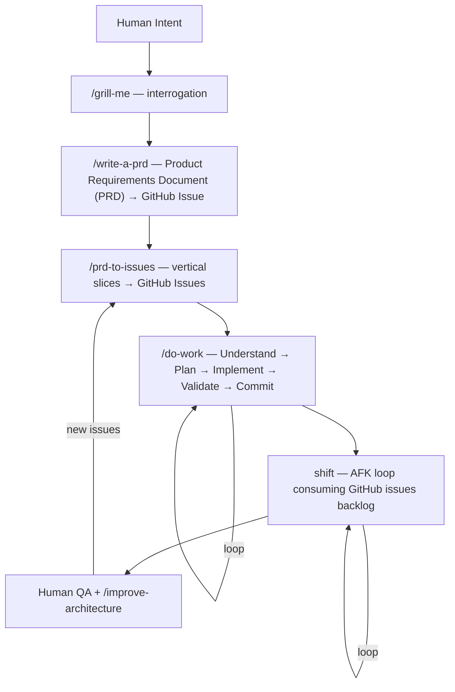

<p align="center">
  
</p>

# ctrl

> Your AI agents, everywhere, autonomous — from a single source of truth.

Most AI coding setups are per-machine and per-session. You paste the same instructions into every chat. You rebuild context from scratch. You watch agents stall on tasks that should run unattended.

**ctrl** fixes that. Clone it to every machine. One `git pull` keeps your agents in sync. Agents load only what's relevant to the current workspace. The endgame: start a shift and wake up to closed issues.

```bash
git clone https://github.com/arndvs/ctrl.git ~/dotfiles
bash ~/dotfiles/bin/bootstrap.sh
```

---

## The pipeline

Scope a feature. Ship it. Never leave your terminal.



Use any skill individually or chain them. The planning pipeline (grill-me → write-a-prd → prd-to-issues → do-work) hands off between stages.

---

## How it works

### One repo, every machine

Clone `ctrl` to `~/dotfiles` on your local machine, your VPS, anywhere. One `git pull` updates instructions, skills, and shell config everywhere. No drift. No re-setup.

### Progressive disclosure

`detect-context.sh` scans your working directory and exports `ACTIVE_CONTEXTS`. A Next.js project loads Next.js rules. A PHP project loads PHP rules. Nothing leaks between stacks. Agents stay focused.

```
VS Code opens a project
  ↓
CLAUDE.md → global.instructions.md (always loaded)
  ↓
detect-context.sh → ACTIVE_CONTEXTS=nextjs,prisma,sanity
  ↓
loads matching instructions/*.md
  ↓
skills/ auto-discovered — workflow + your personal _local/ skills
```

The single setting that makes this work: `"chat.instructionsFilesLocations": {"~/dotfiles": true}` — included in the managed `settings.json` and applied by `sync-settings.sh`.

### Your personal layer, gitignored

`skills/_local/` and `instructions/_local/` are gitignored directories inside the repo. Drop your private, domain-specific, or business-specific skills there. They're auto-discovered by VS Code and Claude Code alongside the public skills — but they never leave your machine unless you push them somewhere private.

```
skills/
├── do-work/           ← public, tracked
├── systematic-debugging/   ← public, tracked
└── _local/            ← GITIGNORED — yours alone
    └── your-skill/SKILL.md
```

### Hardened secrets

Secrets split into two tiers. Agents see config, never credentials.

| File                   | In shell? | Agent-visible? | Contains                    |
| ---------------------- | --------- | -------------- | --------------------------- |
| `secrets/.env.agent`   | Yes       | Yes            | Usernames, hosts, IDs       |
| `secrets/.env.secrets` | No        | No             | API keys, tokens, passwords |

`run-with-secrets.sh` injects credentials into a child process only — they vanish when it exits. Claude Code deny rules block `env`, `printenv`, `cat secrets/*`, and `echo $*KEY*` at the agent level. Agents can't accidentally inherit what they can't see.

---

## Skills

### Workflow

| Skill                  | What it does                                                                                                                                                                                           |
| ---------------------- | ------------------------------------------------------------------------------------------------------------------------------------------------------------------------------------------------------ |
| `do-work`              | Core execution loop — auto-detects your stack's feedback loops (package.json, Makefile, composer.json, pyproject.toml). Understand → Plan → Implement → Validate → Commit. Not hardcoded to any stack. |
| `grill-me`             | Interrogates you about a plan until reaching shared understanding. One question at a time with recommended answers. Explores the codebase instead of asking when it can.                               |
| `write-a-prd`          | Explores codebase, grills you, sketches deep module interfaces, writes Product Requirements Document (PRD) from template, submits as GitHub issue.                                                     |
| `prd-to-issues`        | Breaks a PRD into vertical slices — each independently shippable. Categorizes HITL vs AFK. Creates GitHub issues with blocking relationships + a QA issue.                                             |
| `technical-fellow`     | Implementation planning — vertical slices, AFK/HITL classification, dependency graphs, acceptance criteria.                                                                                            |
| `skill-scaffolder`     | Meta-skill — scaffolds new agent skills from proven patterns. Interview → architecture matrix → complete directory.                                                                                    |
| `explore`              | Parallel subagent codebase exploration — decomposes a topic, spawns focused sub-agents, synthesizes a unified summary.                                                                                 |
| `research`             | Caches expensive exploration into a persistent `research.md` — staleness checks, lifecycle management, handoff to downstream skills.                                                                   |
| `codebase-audit`       | Ruthless code audit — real problems only, grouped by severity. No manufactured issues, no padding.                                                                                                     |
| `improve-architecture` | Finds shallow-module clusters, spawns parallel design agents, recommends the strongest interface, files a GitHub RFC.                                                                                  |
| `tdd`                  | Red-green refactor — failing test → implement → refactor. Backend only. One test per vertical slice.                                                                                                   |
| `systematic-debugging` | Root-cause-first — investigate → pattern analysis → hypothesis → fix. Stops guess-and-check thrashing.                                                                                                 |

### Your local skills

Add your own to `skills/_local/your-skill/SKILL.md`. Auto-discovered immediately. Gitignored. Can be a private git repo inside the directory if you want version control.

---

## shift: autonomous agent loop

> `ctrl` is the system. `shift` is the worker. **ctrl+shift** — you define the rules, shift executes them.

> **Status: infrastructure ready, activation pending.**

shift is not a framework. It's a bash loop that runs Claude against your GitHub issues backlog — sandboxed in Docker for Away From Keyboard (AFK) mode, direct on host for Human In The Loop (HITL).

### Two modes

| Mode | Script          | Use when                                                      |
| ---- | --------------- | ------------------------------------------------------------- |
| HITL | `shift/once.sh` | Learning — runs once while you watch                          |
| AFK  | `shift/afk.sh`  | Shipping — loops in Docker sandbox with a max iteration guard |

AFK mode: Claude picks a task, implements it, commits, closes the issue, picks the next one. Exits when the backlog is empty (`<promise>NO MORE TASKS</promise>`). You review PRs async.

### Task priority order

1. Critical bugfixes — blockers first
2. Dev infrastructure — tests, types, scripts before features
3. Tracer bullets — small end-to-end slices that validate approach
4. Polish and quick wins
5. Refactors

### Docker sandboxing

`--dangerously-skip-permissions` needs a cage. Docker isolates Claude in a micro-VM. It can run commands, write files, use git — but it can't reach your host filesystem.

```bash
docker sandbox run claude .
```

### Activation checklist

- [ ] Claude Max subscription
- [ ] Docker Desktop installed
- [ ] `shift/once.sh`, `shift/afk.sh`, `shift/prompt.md` in place
- [ ] `gh auth login` inside the Docker sandbox
- [ ] Deny rules validated in sandbox
- [ ] 5–10 well-formed GitHub issues ready
- [ ] Start HITL → graduate to AFK (1 iteration) → scale up

---

## What's in the box

```
~/dotfiles/
├── CLAUDE.base.md                   ← edit this — bootstrap generates CLAUDE.md from it
├── CLAUDE.md                        ← GENERATED (gitignored)
├── global.instructions.md           ← universal rules, always loaded
├── settings.json                    ← managed VS Code settings
├── .env.agent.example               ← template for non-sensitive config
├── .env.secrets.example             ← template for API keys and tokens
├── .env.citation.example            ← template for citation-builder skill
├── .gitignore
├── dotfiles.code-workspace
├── instructions/
│   ├── nextjs.instructions.md
│   ├── php.instructions.md
│   ├── sanity.instructions.md
│   ├── sentry.instructions.md
│   ├── google-docs.instructions.md
│   ├── css.instructions.md
│   └── _local/                      ← GITIGNORED — your private instructions
├── skills/
│   ├── do-work/
│   ├── grill-me/
│   ├── write-a-prd/
│   ├── prd-to-issues/
│   ├── technical-fellow/
│   ├── skill-scaffolder/
│   ├── explore/
│   ├── research/
│   ├── codebase-audit/
│   ├── improve-architecture/
│   ├── tdd/
│   ├── systematic-debugging/
│   └── _local/                      ← GITIGNORED — your private skills
├── shift/
│   ├── afk.sh                       AFK autonomous loop
│   ├── once.sh                      HITL single-run
│   └── prompt.md                    shared agent prompt
├── bin/
│   ├── bootstrap.sh                 one-command setup, idempotent
│   ├── agent-shell.sh               launches secrets-free shell for agent sessions
│   ├── sync-settings.sh             merge VS Code settings
│   ├── load-secrets.sh              sources .env.agent into shell
│   ├── run-with-secrets.sh          injects .env.secrets into child process
│   ├── detect-context.sh            exports ACTIVE_CONTEXTS
│   └── validate-env.sh              validates env vars and hardening posture
├── assets/                          ← images (logo, etc.)
├── working/                         ← GITIGNORED — scratch/temp files for long ops
└── secrets/                         ← GITIGNORED
    ├── .env.agent
    ├── .env.secrets
    └── .venv/
```

<details>
<summary>Context detection signals</summary>

`detect-context.sh` scans the current directory for these file signatures:

| Signal       | File                                                        | Context        |
| ------------ | ----------------------------------------------------------- | -------------- |
| Next.js      | `next.config.*`                                             | `nextjs`       |
| React Native | `"react-native"` in `package.json`                          | `react-native` |
| React        | `"react"` in `package.json` (if not Next/Native)            | `react`        |
| Node         | `package.json`                                              | `node`         |
| TypeScript   | `tsconfig.json`                                             | `typescript`   |
| PHP          | `composer.json`                                             | `php`          |
| Sanity       | `sanity.config.*`, `sanity.cli.*`                           | `sanity`       |
| Prisma       | `prisma/schema.prisma`                                      | `prisma`       |
| Docker       | `Dockerfile`, `docker-compose.yml/.yaml`, `compose.yml/.yaml` | `docker`       |
| Python       | `requirements.txt`, `pyproject.toml`, `setup.py`, `Pipfile` | `python`       |
| Laravel      | `artisan`                                                   | `laravel`      |

A `general` context is always set as the baseline — it ensures skills without a specific context trigger still load.

Not all contexts have dedicated instruction files yet — detection scopes skill loading and can trigger custom instructions you add.

</details>

### Key VS Code settings

| Setting                                               | Value                  | Why                                                  |
| ----------------------------------------------------- | ---------------------- | ---------------------------------------------------- |
| `chat.instructionsFilesLocations`                     | `{"~/dotfiles": true, ".github/instructions": true}` | Enables the entire instruction/skill discovery chain |
| `chat.agent.maxRequests`                              | `100000`               | Prevents agent from stopping mid-task                |
| `github.copilot.chat.anthropic.thinking.budgetTokens` | `32000`                | Extended thinking for complex reasoning              |
| `chat.exploreAgent.defaultModel`                      | `Claude Opus 4.6 (copilot)` | Model selection for explore subagent                 |

---

## Installation

<details>
<summary>Quick setup (recommended)</summary>

```bash
git clone https://github.com/arndvs/ctrl.git ~/dotfiles
bash ~/dotfiles/bin/bootstrap.sh
```

Bootstrap is idempotent — safe to re-run. It handles:

- Generating `CLAUDE.md` from `CLAUDE.base.md` + your local instruction files
- Creating `secrets/.env.agent` and `secrets/.env.secrets` from templates
- Symlinking `~/.claude/CLAUDE.md` and `~/.claude/skills/`
- Creating `skills/_local/` and `instructions/_local/`
- Wiring `load-secrets.sh` and `detect-context.sh` into `~/.bashrc`
- Creating the Python venv

After bootstrap:

```bash
$EDITOR ~/dotfiles/secrets/.env.agent       # non-sensitive config
$EDITOR ~/dotfiles/secrets/.env.secrets     # API keys and tokens
bash ~/dotfiles/bin/sync-settings.sh        # merge VS Code settings
source ~/.bashrc
```

> **Windows:** file symlinks require admin. Bootstrap falls back to copying `CLAUDE.md` and prints upgrade instructions. Directory symlinks work via Developer Mode.

</details>

<details>
<summary>VPS setup</summary>

Same as local — but skip `sync-settings.sh`. VS Code Remote SSH forwards your local settings automatically.

```bash
git clone https://github.com/arndvs/ctrl.git ~/dotfiles
bash ~/dotfiles/bin/bootstrap.sh
$EDITOR ~/dotfiles/secrets/.env.agent
$EDITOR ~/dotfiles/secrets/.env.secrets
source ~/.bashrc
```

Verify:

```bash
readlink ~/.claude/CLAUDE.md     # → ~/dotfiles/CLAUDE.md
readlink ~/.claude/skills        # → ~/dotfiles/skills
echo $GITHUB_USERNAME
cd ~/some-project && echo $ACTIVE_CONTEXTS
```

</details>

<details>
<summary>Manual setup</summary>

```bash
# 1. Clone
git clone https://github.com/arndvs/ctrl.git ~/dotfiles

# 2. Generate CLAUDE.md and symlink
bash ~/dotfiles/bin/bootstrap.sh   # or manually:
mkdir -p ~/.claude
ln -sf ~/dotfiles/CLAUDE.md ~/.claude/CLAUDE.md
ln -sf ~/dotfiles/skills ~/.claude/skills

# 3. Secrets
cp ~/dotfiles/.env.agent.example ~/dotfiles/secrets/.env.agent
cp ~/dotfiles/.env.secrets.example ~/dotfiles/secrets/.env.secrets

# 4. Shell integration — add to ~/.bashrc
[[ -f ~/dotfiles/bin/load-secrets.sh ]] && source ~/dotfiles/bin/load-secrets.sh
_load_context() { [[ -f ~/dotfiles/bin/detect-context.sh ]] && source ~/dotfiles/bin/detect-context.sh > /dev/null 2>&1; }
cd() { builtin cd "$@" && _load_context; }
_load_context

# 5. VS Code settings
bash ~/dotfiles/bin/sync-settings.sh
```

</details>

---

## Customization

| Want to...                | Do this                                                                                                                                     |
| ------------------------- | ------------------------------------------------------------------------------------------------------------------------------------------- |
| Add a new stack           | Create `instructions/yourstack.instructions.md`, add detection to `detect-context.sh`, reference in `CLAUDE.base.md`, re-run `bootstrap.sh` |
| Add a public skill        | Create `skills/your-skill/SKILL.md` — auto-discovered                                                                                       |
| Add a private skill       | Create `skills/_local/your-skill/SKILL.md` — auto-discovered, gitignored                                                                    |
| Add a private instruction | Create `instructions/_local/your-topic.instructions.md`, re-run `bootstrap.sh`                                                              |
| Add config                | Add key to `.env.agent.example`, value to `secrets/.env.agent`                                                                              |
| Add a secret              | Add key to `.env.secrets.example`, value to `secrets/.env.secrets`                                                                          |

## Updating

```bash
cd ~/dotfiles && git pull
bash ~/dotfiles/bin/bootstrap.sh        # re-validates, fixes stale symlinks
bash ~/dotfiles/bin/sync-settings.sh    # local only — skip on VPS
source ~/.bashrc
```

---

## Troubleshooting

<details>
<summary>Common issues</summary>

**Instructions not loading in Copilot Chat**

- `readlink ~/.claude/CLAUDE.md` — should point to `~/dotfiles/CLAUDE.md`
- If not a symlink, re-run `bash ~/dotfiles/bin/bootstrap.sh`
- Verify `chat.instructionsFilesLocations` has `"~/dotfiles": true`

**`secrets/.env.agent not found` on shell startup**

- `cp ~/dotfiles/.env.agent.example ~/dotfiles/secrets/.env.agent`
- Fill it in: `$EDITOR ~/dotfiles/secrets/.env.agent`

**`sync-settings.sh` fails on VPS**

- Expected. VS Code Remote SSH forwards local settings — don't run sync on VPS.

**`ACTIVE_CONTEXTS` empty**

- `grep "detect-context" ~/.bashrc` — if missing, re-run bootstrap
- Detection runs on `cd` — navigate into a project first

**Python venv broken**

- `rm -rf ~/dotfiles/secrets/.venv && bash ~/dotfiles/bin/bootstrap.sh`

</details>

---

## Prerequisites

- [VS Code Insiders](https://code.visualstudio.com/insiders/) + [GitHub Copilot](https://github.com/features/copilot)
- Git Bash (Windows) or bash (Linux/macOS)
- Python 3.10+
- Docker Desktop (for shift)

---

Originally forked from [kangarko/ai-files](https://github.com/kangarko/ai-files).

> **Naming conventions:** The GitHub repo is `arndvs/ctrl` but the on-disk path is `~/dotfiles` — hardcoded across 40+ references. Clone it to `~/dotfiles` and leave it there. `ctrl` is the system, `shift` is the autonomous agent loop. The pairing is deliberate: **ctrl+shift** — you define the rules, shift executes them.
