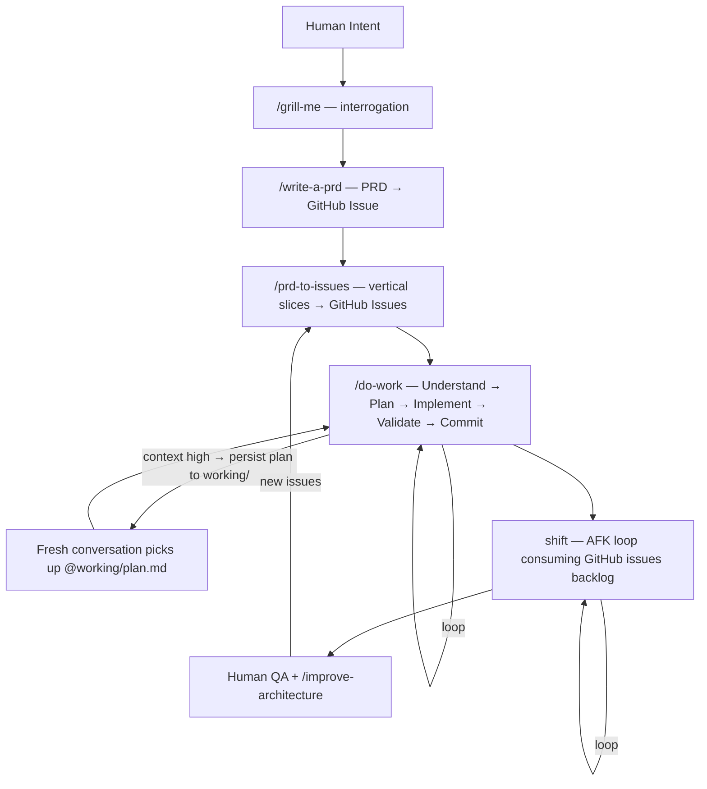

<p align="center">
  
</p>

# ctrl

> Dotfiles for AI coding agents. One repo syncs instructions, skills, secrets, and autonomous loops across every machine.

Every developer using Claude Code or Copilot hits the same walls. Context degrades mid-task — the agent repeats itself, compaction loses nuance, quality drops. Instructions drift between your laptop and VPS. Secrets leak into agent context. Irrelevant rules load for every project regardless of stack.

ctrl fixes all four. Clone it once, `bootstrap.sh` symlinks your instructions and skills into `~/.claude/`, and `git pull` updates every machine. `detect-context.sh` loads only the rules that match your current stack. Secrets split into two tiers — config the agent can see, credentials that exist only inside a child process and vanish when it exits (`run-with-secrets.sh`). When context gets high, the agent persists its plan to `working/` so a fresh conversation continues exactly where the old one left off.

```bash
git clone https://github.com/arndvs/ctrl.git ~/dotfiles
bash ~/dotfiles/bin/bootstrap.sh
```

Bootstrap is idempotent and cross-platform (228 lines). It symlinks `~/.claude/CLAUDE.md` and `~/.claude/skills/`, wires shell integration into `~/.bashrc`/`~/.zshrc`, creates `secrets/` from templates, and adds supply chain protection to `~/.npmrc` and `uv.toml`. Full details in the [Installation](#installation) section.

---

## The pipeline

```
/grill-me       → Interrogate you about a feature until shared understanding
/write-a-prd    → Explore codebase, interview, write PRD, submit as GitHub issue
/prd-to-issues  → Break the PRD into vertical slices → GitHub issues (AFK vs HITL labeled)
/do-work        → Understand → Plan → Implement → Validate → Commit (loops)
shift           → Pick issues from the backlog, implement in a Docker sandbox, commit, repeat
```

Use any skill individually or chain them. The planning pipeline hands off between stages automatically.



---

## Continuous workflow

Large tasks outgrow a single conversation. When context gets high, the agent commits current work, writes the remaining plan to `working/<name>-plan.md`, and outputs a pickup command:

```
@working/docs-audit-plan.md — pick up on remaining slices. Start with Slice 2.
```

Paste that into a fresh conversation. It reads the plan and continues where the old one left off — no re-exploration, no lost context. This is enforced by `global.instructions.md` and built into the `do-work`, `technical-fellow`, `prd-to-issues`, and `research` skills. The agent does it automatically.

```
Conversation 1:  Plan → Slice 1 → commit → context high → write plan → hand off
Conversation 2:  Read plan → Slice 2 → Slice 3 → context high → update plan → hand off
Conversation 3:  Read plan → Slice 4 → QA → done → delete plan
```

`working/` is gitignored. Plans are working documents, not permanent docs — delete them when the work ships.

---

## How it works

### One repo, every machine

Clone to `~/dotfiles` on your laptop, your VPS, anywhere. `git pull` updates both. That's it.

You edit `CLAUDE.base.md` (tracked in git). `bootstrap.sh` generates `CLAUDE.md` from it by appending `@`-references to any local instruction files in `instructions/_local/`. The generated file is symlinked to `~/.claude/` and read by Claude Code at runtime.

### Progressive context loading

`detect-context.sh` scans your working directory and exports `ACTIVE_CONTEXTS`. A Next.js project loads Next.js rules. A PHP project loads PHP rules. Nothing leaks between stacks.

```
VS Code opens a project
  ↓
CLAUDE.md → global.instructions.md (always loaded)
  ↓
detect-context.sh → ACTIVE_CONTEXTS=general,nextjs,node,typescript,sanity,prisma
  ↓
loads matching instructions/*.md
  ↓
skills/ auto-discovered — workflow + your personal _local/ skills
```

One setting enables the chain: `"chat.instructionsFilesLocations": {"~/dotfiles": true}` — included in `settings.json`, applied by `sync-settings.sh`.

### Private skills and instructions

`skills/_local/` and `instructions/_local/` are gitignored. Drop private or business-specific files there — auto-discovered alongside the public ones, never leave your machine.

```
skills/
├── do-work/                 ← public, tracked
├── systematic-debugging/    ← public, tracked
└── _local/                  ← GITIGNORED — yours alone
    └── your-skill/SKILL.md
```

### Hardened secrets

Two tiers. Agents see config, never credentials.

| File                   | In shell? | Agent-visible? | Contains                    |
| ---------------------- | --------- | -------------- | --------------------------- |
| `secrets/.env.agent`   | Yes       | Yes            | Usernames, hosts, IDs       |
| `secrets/.env.secrets` | No        | No             | API keys, tokens, passwords |

```bash
bash ~/dotfiles/bin/run-with-secrets.sh python deploy.py
```

Secrets exist only in the child process. They vanish when it exits. `validate-env.sh` checks that credentials haven't leaked into your shell environment and that Claude Code deny rules are configured.

---

## Skills

| Skill                  | What it does                                                                                                                     |
| ---------------------- | -------------------------------------------------------------------------------------------------------------------------------- |
| `do-work`              | Detect your stack's feedback loops. Understand → Plan → Implement → Validate → Commit.                                           |
| `grill-me`             | Interrogate you about a plan until shared understanding. One question at a time, recommended answers.                            |
| `write-a-prd`          | Explore codebase, interview you, sketch module boundaries, write PRD, submit as GitHub issue.                                    |
| `prd-to-issues`        | Break a PRD into vertical slices. Label each AFK or HITL. Create GitHub issues with dependencies.                                |
| `technical-fellow`     | Plan implementation — vertical slices, dependency graphs, acceptance criteria. (107 lines)                                       |
| `skill-scaffolder`     | Scaffold new agent skills from production-tested patterns. Interview → architecture → directory. (430 lines + 4 reference files) |
| `explore`              | Decompose a topic, spawn parallel sub-agents, synthesize a summary.                                                              |
| `research`             | Cache expensive exploration into `research.md`. Staleness checks, lifecycle management.                                          |
| `codebase-audit`       | Ruthless code audit — real problems only, grouped by severity. No manufactured issues.                                           |
| `improve-architecture` | Find shallow-module clusters, spawn parallel design agents, file a GitHub RFC.                                                   |
| `tdd`                  | Red-green refactor. Failing test → implement → refactor. Backend only.                                                           |
| `systematic-debugging` | Root-cause-first — investigate → pattern analysis → hypothesis → fix. (195 lines + 5 reference files)                            |

Add your own: `skills/_local/your-skill/SKILL.md` — auto-discovered, gitignored.

---

## shift: autonomous agent loop

> `ctrl` is the system. `shift` is the worker. **ctrl+shift** — you define the rules, shift executes them.

121 lines of bash. Picks a GitHub issue, implements it, commits, closes it, repeats. Sandboxed in a [Docker microVM](https://docs.docker.com/ai/sandboxes/) for AFK mode, direct on host for HITL.

| Mode | Script          | Use when                                            |
| ---- | --------------- | --------------------------------------------------- |
| HITL | `shift/once.sh` | Learning — runs once, you watch and intervene       |
| AFK  | `shift/afk.sh`  | Shipping — loops in Docker sandbox, iteration guard |

Start with HITL. Graduate to AFK with one iteration. Scale up.

```bash
cd ~/your-project

bash ~/dotfiles/shift/once.sh          # HITL — run once
bash ~/dotfiles/shift/afk.sh           # AFK — 5 iterations (default)
bash ~/dotfiles/shift/afk.sh 20        # AFK — 20 iterations
```

Each iteration, `_build_prompt.sh` fetches open GitHub issues, grabs recent commits, sanitizes XML tags to prevent prompt injection, and pipes the assembled prompt to Claude. The AFK loop exits when the backlog is empty (`<promise>NO MORE TASKS</promise>`) or max iterations are reached. A lock directory prevents concurrent runs.

Task priority: critical bugfixes → dev infrastructure → tracer bullets → polish → refactors.

### How ctrl mounts into the sandbox

`sbx run` mounts `~/dotfiles` read-only alongside your project. The agent gets your full instruction set inside the sandbox without being able to modify it:

```bash
sbx run claude . ~/dotfiles:ro
```

| Mount               | Access     | Contains                                         |
| ------------------- | ---------- | ------------------------------------------------ |
| `.` (project)       | read-write | The codebase the agent works on                  |
| `~/dotfiles` (ctrl) | read-only  | Instructions, skills, global rules, shift prompt |

<details>
<summary>Docker Sandbox setup</summary>

shift uses [Docker Sandboxes](https://docs.docker.com/ai/sandboxes/) (`sbx` CLI) — lightweight microVMs with their own Docker daemon, filesystem, and network. Docker Desktop is not required.

#### Prerequisites

| Requirement                 | Install                                                                                                                       |
| --------------------------- | ----------------------------------------------------------------------------------------------------------------------------- |
| `sbx` CLI                   | macOS: `brew install docker/tap/sbx` · Windows: [sbx-releases](https://github.com/docker/sbx-releases/releases)               |
| Windows Hypervisor Platform | `Enable-WindowsOptionalFeature -Online -FeatureName HypervisorPlatform -All` (elevated PowerShell, Windows only)              |
| `gh` (GitHub CLI)           | macOS: `brew install gh` · Windows: `winget install GitHub.cli` · [cli.github.com](https://cli.github.com/)                   |
| `jq`                        | macOS: `brew install jq` · Windows: `winget install jqlang.jq` · [jqlang.github.io/jq](https://jqlang.github.io/jq/download/) |
| Claude subscription         | Claude Max, Team, or Enterprise (for sandbox OAuth)                                                                           |

#### One-time setup

```bash
sbx login
sbx secret set -g github -t "$(gh auth token)"
sbx secret ls
```

Claude authentication happens inside the sandbox on first run — use `/login` when prompted. The session token persists on your host via proxy, never stored inside the sandbox.

#### Branch mode (optional)

For safer AFK runs, use `--branch` to give the agent its own git worktree:

```bash
sbx run --name shift-afk --branch auto claude . ~/dotfiles:ro -- ...
```

Review changes before merging:

```bash
cd .sbx/<sandbox-name>-worktrees/<branch>
git log
git push -u origin <branch>
gh pr create
```

Add `.sbx/` to your project's `.gitignore` when using branch mode.

#### Managing sandboxes

```bash
sbx ls                         # list running
sbx stop <name>                # pause (packages preserved)
sbx rm <name>                  # delete
sbx exec -it <name> bash       # shell in
sbx policy ls                  # check network rules
sbx policy allow network <host> # allow a blocked host
```

</details>

### Activation checklist

- [ ] `sbx` CLI installed and `sbx login` completed
- [ ] `sbx secret set -g github -t "$(gh auth token)"`
- [ ] `gh` CLI installed and authenticated (`gh auth login`)
- [ ] `jq` installed
- [ ] Claude Max/Team/Enterprise subscription
- [ ] `bootstrap.sh` run (symlinks `~/.claude/CLAUDE.md` and `~/.claude/skills/`)
- [ ] 5–10 well-formed GitHub issues ready
- [ ] Start HITL → graduate to AFK (1 iteration) → scale up

---

## What's in the box

```
~/dotfiles/
├── CLAUDE.base.md                   ← edit this — bootstrap generates CLAUDE.md from it
├── CLAUDE.md                        ← GENERATED (gitignored)
├── global.instructions.md           ← universal rules, always loaded
├── settings.json                    ← managed VS Code settings
├── .env.agent.example               ← template for non-sensitive config
├── .env.secrets.example             ← template for API keys and tokens
├── instructions/
│   ├── nextjs.instructions.md
│   ├── php.instructions.md
│   ├── sanity.instructions.md
│   ├── sentry.instructions.md
│   ├── google-docs.instructions.md
│   ├── css.instructions.md
│   ├── ux-prototyping.instructions.md
│   └── _local/                      ← GITIGNORED — your private instructions
├── skills/
│   ├── do-work/
│   ├── grill-me/
│   ├── write-a-prd/
│   ├── prd-to-issues/
│   ├── technical-fellow/
│   ├── skill-scaffolder/
│   ├── explore/
│   ├── research/
│   ├── codebase-audit/
│   ├── improve-architecture/
│   ├── tdd/
│   ├── systematic-debugging/
│   └── _local/                      ← GITIGNORED — your private skills
├── shift/
│   ├── afk.sh                       AFK autonomous loop
│   ├── once.sh                      HITL single-run
│   ├── _build_prompt.sh             shared prompt builder
│   └── prompt.md                    shared agent prompt
├── bin/
│   ├── _lib.sh                      shared utilities
│   ├── bootstrap.sh                 one-command setup, idempotent
│   ├── agent-shell.sh               secrets-free shell for agent sessions
│   ├── sync-settings.sh             deep-merge VS Code settings
│   ├── load-secrets.sh              sources .env.agent into shell
│   ├── run-with-secrets.sh          process-scoped secret injection
│   ├── detect-context.sh            exports ACTIVE_CONTEXTS
│   └── validate-env.sh              env + hardening validation
├── assets/
├── working/                         ← GITIGNORED — cross-conversation plans
└── secrets/                         ← GITIGNORED
    ├── .env.agent
    ├── .env.secrets
    └── .venv/
```

<details>
<summary>Context detection signals</summary>

`detect-context.sh` scans the current directory for these file signatures:

| Signal       | File                                                          | Context        |
| ------------ | ------------------------------------------------------------- | -------------- |
| Next.js      | `next.config.{ts,js,mjs}`                                     | `nextjs`       |
| React Native | `"react-native"` in `package.json`                            | `react-native` |
| React        | `"react"` in `package.json` (if not Next/Native)              | `react`        |
| Node         | `package.json`                                                | `node`         |
| TypeScript   | `tsconfig.json`                                               | `typescript`   |
| PHP          | `composer.json`                                               | `php`          |
| Sanity       | `sanity.config.{ts,js,mjs,mts}`, `sanity.cli.{ts,js}`         | `sanity`       |
| Prisma       | `prisma/schema.prisma`                                        | `prisma`       |
| Docker       | `Dockerfile`, `docker-compose.yml/.yaml`, `compose.yml/.yaml` | `docker`       |
| Python       | `requirements.txt`, `pyproject.toml`, `setup.py`, `Pipfile`   | `python`       |
| Laravel      | `artisan`                                                     | `laravel`      |

</details>

<details>
<summary>Key VS Code settings</summary>

| Setting                                               | Value                                                | Why                                       |
| ----------------------------------------------------- | ---------------------------------------------------- | ----------------------------------------- |
| `chat.instructionsFilesLocations`                     | `{"~/dotfiles": true, ".github/instructions": true}` | Enables instruction/skill discovery chain |
| `chat.agent.maxRequests`                              | `100000`                                             | Prevents agent from stopping mid-task     |
| `github.copilot.chat.anthropic.thinking.budgetTokens` | `32000`                                              | Extended thinking for complex reasoning   |
| `chat.exploreAgent.defaultModel`                      | `Claude Opus 4.6 (copilot)`                          | Model selection for explore subagent      |

</details>

---

## Installation

<details>
<summary>Quick setup (recommended)</summary>

```bash
git clone https://github.com/arndvs/ctrl.git ~/dotfiles
bash ~/dotfiles/bin/bootstrap.sh
```

After bootstrap:

```bash
$EDITOR ~/dotfiles/secrets/.env.agent       # non-sensitive config
$EDITOR ~/dotfiles/secrets/.env.secrets     # API keys and tokens
bash ~/dotfiles/bin/sync-settings.sh        # merge VS Code settings
source ~/.bashrc
```

> **Windows:** file symlinks require admin. Bootstrap falls back to copying `CLAUDE.md` and prints upgrade instructions. Directory symlinks work via Developer Mode.

</details>

<details>
<summary>VPS setup</summary>

Same as local — skip `sync-settings.sh` (VS Code Remote SSH forwards your settings).

```bash
git clone https://github.com/arndvs/ctrl.git ~/dotfiles
bash ~/dotfiles/bin/bootstrap.sh
$EDITOR ~/dotfiles/secrets/.env.agent
$EDITOR ~/dotfiles/secrets/.env.secrets
source ~/.bashrc
```

</details>

<details>
<summary>Manual setup</summary>

```bash
# 1. Clone
git clone https://github.com/arndvs/ctrl.git ~/dotfiles

# 2. Generate CLAUDE.md and symlink
bash ~/dotfiles/bin/bootstrap.sh   # or manually:
mkdir -p ~/.claude
ln -sf ~/dotfiles/CLAUDE.md ~/.claude/CLAUDE.md
ln -sf ~/dotfiles/skills ~/.claude/skills

# 3. Secrets
cp ~/dotfiles/.env.agent.example ~/dotfiles/secrets/.env.agent
cp ~/dotfiles/.env.secrets.example ~/dotfiles/secrets/.env.secrets

# 4. Shell integration — add to ~/.bashrc
[[ -f ~/dotfiles/bin/load-secrets.sh ]] && source ~/dotfiles/bin/load-secrets.sh
_load_context() { [[ -f ~/dotfiles/bin/detect-context.sh ]] && source ~/dotfiles/bin/detect-context.sh > /dev/null 2>&1; }
cd() { builtin cd "$@" && _load_context; }
_load_context

# 5. VS Code settings
bash ~/dotfiles/bin/sync-settings.sh
```

</details>

<details>
<summary>What bootstrap touches</summary>

> Bootstrap is mostly idempotent. Here's everything it modifies:

| File                     | Change                                                                   |
| ------------------------ | ------------------------------------------------------------------------ |
| `~/.claude/CLAUDE.md`    | Symlinked → `~/dotfiles/CLAUDE.md` (or copied on Windows without admin)  |
| `~/.claude/skills/`      | Symlinked → `~/dotfiles/skills/` (existing real dirs left alone)         |
| `~/.bashrc` / `~/.zshrc` | Appends `load-secrets.sh` + `detect-context.sh` integration (idempotent) |
| `~/.npmrc`               | Appends `min-release-age=7` (supply chain protection)                    |
| `~/.config/uv/uv.toml`   | Adds `exclude-newer` date (supply chain protection)                      |
| `secrets/.env.agent`     | Created from `.env.agent.example` if missing                             |
| `secrets/.env.secrets`   | Created from `.env.secrets.example` if missing                           |
| `secrets/.venv/`         | Python venv created for local skill packages                             |

**Not run by bootstrap:** `sync-settings.sh` (VS Code settings merge) is manual. Run with `--dry-run` first.

</details>

---

## Customization

| Want to...                | Do this                                                                                                                                     |
| ------------------------- | ------------------------------------------------------------------------------------------------------------------------------------------- |
| Add a new stack           | Create `instructions/yourstack.instructions.md`, add detection to `detect-context.sh`, reference in `CLAUDE.base.md`, re-run `bootstrap.sh` |
| Add a public skill        | Create `skills/your-skill/SKILL.md` — auto-discovered                                                                                       |
| Add a private skill       | Create `skills/_local/your-skill/SKILL.md` — auto-discovered, gitignored                                                                    |
| Add a private instruction | Create `instructions/_local/your-topic.instructions.md`, re-run `bootstrap.sh`                                                              |
| Add config                | Add key to `.env.agent.example`, value to `secrets/.env.agent`                                                                              |
| Add a secret              | Add key to `.env.secrets.example`, value to `secrets/.env.secrets`                                                                          |

## Updating

```bash
cd ~/dotfiles && git pull
bash ~/dotfiles/bin/bootstrap.sh        # re-validates, fixes stale symlinks
bash ~/dotfiles/bin/sync-settings.sh    # local only — skip on VPS
source ~/.bashrc
```

---

## Troubleshooting

<details>
<summary>Common issues</summary>

**Instructions not loading in Copilot Chat**

- `readlink ~/.claude/CLAUDE.md` — should point to `~/dotfiles/CLAUDE.md`
- If not a symlink, re-run `bash ~/dotfiles/bin/bootstrap.sh`
- Verify `chat.instructionsFilesLocations` has `"~/dotfiles": true`

**`secrets/.env.agent not found` on shell startup**

- `cp ~/dotfiles/.env.agent.example ~/dotfiles/secrets/.env.agent`
- Fill it in: `$EDITOR ~/dotfiles/secrets/.env.agent`

**`sync-settings.sh` fails on VPS**

- Expected. VS Code Remote SSH forwards local settings — don't run sync on VPS.

**`ACTIVE_CONTEXTS` empty**

- `grep "detect-context" ~/.bashrc` — if missing, re-run bootstrap
- Detection runs on `cd` — navigate into a project first

**Python venv broken**

- `rm -rf ~/dotfiles/secrets/.venv && bash ~/dotfiles/bin/bootstrap.sh`

**shift: `sbx: command not found`**

- Install: macOS `brew install docker/tap/sbx`, Windows [sbx-releases](https://github.com/docker/sbx-releases/releases)
- Docker Desktop is not required

**shift: `gh: command not found` or empty issue list**

- Install: `brew install gh` or [cli.github.com](https://cli.github.com/)
- Authenticate: `gh auth login`

**shift: sandbox can't reach GitHub or APIs**

- `sbx policy ls` → `sbx policy allow network <hostname>`

**shift: Claude not authenticated inside sandbox**

- Use `/login` on first run. Token persists across restarts.
- Alternative: `sbx secret set -g anthropic`

**shift: skills/instructions not available in sandbox**

- Verify bootstrap ran: `readlink ~/.claude/CLAUDE.md` → `~/dotfiles/CLAUDE.md`
- AFK script mounts `~/dotfiles:ro` — verify in `afk.sh`
- Shell in to check: `sbx exec -it <name> bash`, then `ls ~/dotfiles/`

</details>

---

## Prerequisites

- [VS Code](https://code.visualstudio.com/) (stable or Insiders)
- [GitHub Copilot](https://github.com/features/copilot) (optional — ctrl works with Claude Code alone)
- Git Bash (Windows) or bash (Linux/macOS)
- Python 3.10+
- [`sbx` CLI](https://docs.docker.com/ai/sandboxes/get-started/) (shift AFK mode only)
- [GitHub CLI (`gh`)](https://cli.github.com/) (shift only)
- `jq` (shift only)

---

> **Naming:** The GitHub repo is `arndvs/ctrl` but the on-disk path is `~/dotfiles` — hardcoded across 40+ references. Clone it to `~/dotfiles` and leave it there.
